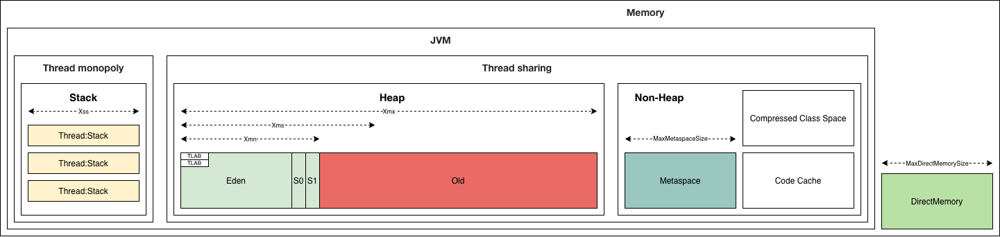
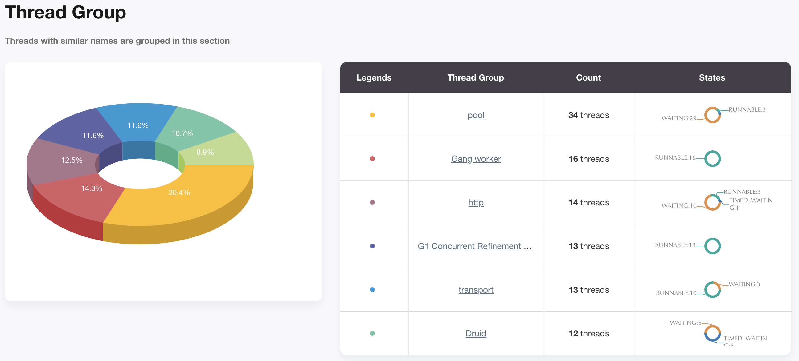
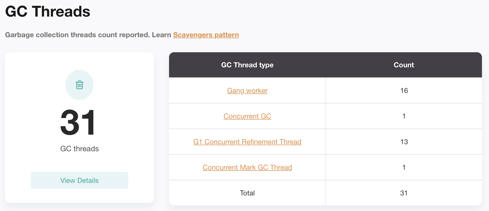

### 周四

### 第1题

#### 描述

> 自己写一个简单的Hello.java，里面需要涉及基本类型，四则运行，if和for，然后自己分析一下对应的字节码，有问题群里讨论。

#### 解答

##### 源代码

```java
package me.zhongmingwu.week01;

public class Hello {
    private boolean aBoolean;
    private byte aByte;
    private char aChar;
    private short aShort;
    private int anInt;
    private long aLong;
    private float aFloat;
    private double aDouble;

    public Hello(boolean aBoolean, byte aByte, char aChar, short aShort, int anInt, long aLong, float aFloat, double aDouble) {
        this.aBoolean = aBoolean;
        this.aByte = aByte;
        this.aChar = aChar;
        this.aShort = aShort;
        this.anInt = anInt;
        this.aLong = aLong;
        this.aFloat = aFloat;
        this.aDouble = aDouble;
    }

    public void testArithmetic() {
        int a = aByte + aChar;
        int b = aChar - aShort;
        long c = anInt * aLong;
        float d = aLong / aFloat;
    }

    public int testIf() {
        if (aByte > 0b101) {
            return 1;
        }
        return -1;
    }

    public void testFor() {
        int sum = 0;
        for (int i = 0; i < aChar; i++) {
            sum += i;
        }
    }
}
```

##### 字节码

```
$ javac -g me/zhongmingwu/week01/Hello.java

$ md5 me/zhongmingwu/week01/Hello.class
MD5 (me/zhongmingwu/week01/Hello.class) = 0ac7097c8a625590af9282b9d3e2635f

$ ls -l me/zhongmingwu/week01/Hello.class
-rw-r--r--  1 xxxx  staff  1162 Oct 20 09:13 me/zhongmingwu/week01/Hello.class

$  ~/.sdkman/candidates/java/7.0.262-zulu/bin/java me.zhongmingwu.week01.Hello
Exception in thread "main" java.lang.UnsupportedClassVersionError: me/zhongmingwu/week01/Hello : Unsupported major.minor version 52.0
	at java.lang.ClassLoader.defineClass1(Native Method)
	at java.lang.ClassLoader.defineClass(ClassLoader.java:808)
	at java.security.SecureClassLoader.defineClass(SecureClassLoader.java:142)
	at java.net.URLClassLoader.defineClass(URLClassLoader.java:443)
	at java.net.URLClassLoader.access$100(URLClassLoader.java:65)
	at java.net.URLClassLoader$1.run(URLClassLoader.java:355)
	at java.net.URLClassLoader$1.run(URLClassLoader.java:349)
	at java.security.AccessController.doPrivileged(Native Method)
	at java.net.URLClassLoader.findClass(URLClassLoader.java:348)
	at java.lang.ClassLoader.loadClass(ClassLoader.java:430)
	at sun.misc.Launcher$AppClassLoader.loadClass(Launcher.java:329)
	at java.lang.ClassLoader.loadClass(ClassLoader.java:363)
	at sun.launcher.LauncherHelper.checkAndLoadMain(LauncherHelper.java:588)
	
$ javap -v -l -c me.zhongmingwu.week01.Hello
```

```sql
Classfile ${path}/JAVA-000/java-training-camp/src/main/java/me/zhongmingwu/week01/Hello.class -- 字节码文件的绝对路径
  Last modified Oct 20, 2020; size 1162 bytes -- 最近编译时间，字节码文件的大小
  MD5 checksum 0ac7097c8a625590af9282b9d3e2635f -- 字节码文件的MD5校验码
  Compiled from "Hello.java" -- 被编译的源代码文件
public class me.zhongmingwu.week01.Hello -- 全限定名：包名+类名
  minor version: 0
  major version: 52 -- 字节码的版本，低版本JVM无法执行高版本字节码，52对应Java 8
  flags: ACC_PUBLIC, ACC_SUPER -- ACC_PUBLIC为类的访问权限
Constant pool: -- 常量池，组合起来构成字节码文件中的各种符号引用，符号引用会在类加载的解析阶段，解析成内存中的实际引用
   #1 = Methodref          #11.#49        // java/lang/Object."<init>":()V -- 方法引用
   #2 = Fieldref           #10.#50        // me/zhongmingwu/week01/Hello.aBoolean:Z -- 字段引用
   #3 = Fieldref           #10.#51        // me/zhongmingwu/week01/Hello.aByte:B
   #4 = Fieldref           #10.#52        // me/zhongmingwu/week01/Hello.aChar:C
   #5 = Fieldref           #10.#53        // me/zhongmingwu/week01/Hello.aShort:S
   #6 = Fieldref           #10.#54        // me/zhongmingwu/week01/Hello.anInt:I
   #7 = Fieldref           #10.#55        // me/zhongmingwu/week01/Hello.aLong:J
   #8 = Fieldref           #10.#56        // me/zhongmingwu/week01/Hello.aFloat:F
   #9 = Fieldref           #10.#57        // me/zhongmingwu/week01/Hello.aDouble:D
  #10 = Class              #58            // me/zhongmingwu/week01/Hello
  #11 = Class              #59            // java/lang/Object
  #12 = Utf8               aBoolean
  #13 = Utf8               Z
  #14 = Utf8               aByte
  #15 = Utf8               B
  #16 = Utf8               aChar
  #17 = Utf8               C
  #18 = Utf8               aShort
  #19 = Utf8               S
  #20 = Utf8               anInt
  #21 = Utf8               I
  #22 = Utf8               aLong
  #23 = Utf8               J
  #24 = Utf8               aFloat
  #25 = Utf8               F
  #26 = Utf8               aDouble
  #27 = Utf8               D
  #28 = Utf8               <init>
  #29 = Utf8               (ZBCSIJFD)V
  #30 = Utf8               Code
  #31 = Utf8               LineNumberTable
  #32 = Utf8               LocalVariableTable
  #33 = Utf8               this
  #34 = Utf8               Lme/zhongmingwu/week01/Hello;
  #35 = Utf8               testArithmetic
  #36 = Utf8               ()V
  #37 = Utf8               a
  #38 = Utf8               b
  #39 = Utf8               c
  #40 = Utf8               d
  #41 = Utf8               testIf
  #42 = Utf8               ()I
  #43 = Utf8               StackMapTable
  #44 = Utf8               testFor
  #45 = Utf8               i
  #46 = Utf8               sum
  #47 = Utf8               SourceFile
  #48 = Utf8               Hello.java
  #49 = NameAndType        #28:#36        // "<init>":()V -- 名称+类型
  #50 = NameAndType        #12:#13        // aBoolean:Z
  #51 = NameAndType        #14:#15        // aByte:B
  #52 = NameAndType        #16:#17        // aChar:C
  #53 = NameAndType        #18:#19        // aShort:S
  #54 = NameAndType        #20:#21        // anInt:I
  #55 = NameAndType        #22:#23        // aLong:J
  #56 = NameAndType        #24:#25        // aFloat:F
  #57 = NameAndType        #26:#27        // aDouble:D
  #58 = Utf8               me/zhongmingwu/week01/Hello
  #59 = Utf8               java/lang/Object
{
  public me.zhongmingwu.week01.Hello(boolean, byte, char, short, int, long, float, double); -- 构造函数
    descriptor: (ZBCSIJFD)V -- 描述符 <Z:boolean>,<B:byte>,<C:char>,<S:short>,<I:int>,<J:long>,<F:float>,<D:double>
    flags: ACC_PUBLIC -- ACC_PUBLIC为方法的访问权限
    Code:
      -- 操作数栈：深度为3
      -- 局部变量表：long和double需要占用2个slot，在非静态方法中，slot 0会存放this引用，结合描述符，总共需要11个slot
      -- 参数：长度为9（包含this引用），在执行方法体前，会依照描述符把参数设置到局部变量表中（不同类型的参数会占用不同数量的slot）
      stack=3, locals=11, args_size=9
         0: aload_0 -- slot 0压栈（this引用），栈深为1
         1: invokespecial #1	// Method java/lang/Object."<init>":()V -- this引用出栈，调用其父类（Object）的构造函数
         4: aload_0 -- slot 0压栈（this引用），栈深为1
         5: iload_1 -- slot 1压栈（Z:boolean），栈深为2
         6: putfield      #2	// Field aBoolean:Z -- 依据常量池可以得到字段类型，出栈2个元素，为this的aBoolean赋值，此时栈深为0
         9: aload_0
        10: iload_2
        11: putfield      #3	// Field aByte:B
        14: aload_0
        15: iload_3
        16: putfield      #4	// Field aChar:C
        19: aload_0
        20: iload         4
        22: putfield      #5	// Field aShort:S
        25: aload_0
        26: iload         5
        28: putfield      #6	// Field anInt:I
        31: aload_0 -- slot 0压栈（this引用），栈深为1
        32: lload         6 -- slot 6和slot 7压栈（lload需要两个slot），栈深为3，此时达到最大栈深
        34: putfield      #7	// Field aLong:J
        37: aload_0
        38: fload         8
        40: putfield      #8	// Field aFloat:F
        43: aload_0
        44: dload         9
        46: putfield      #9	// Field aDouble:D
        49: return
      LineNumberTable: -- 源代码:字节码偏移量
        line 13: 0 -- 方法开始
        line 14: 4 -- this.aBoolean = aBoolean：this引用压栈
        line 15: 9 -- this.aByte = aByte：this引用压栈
        line 16: 14 -- this.aChar = aChar：this引用压栈
        line 17: 19 -- this.aShort = aShort：this引用压栈
        line 18: 25 -- this.anInt = anInt：this引用压栈
        line 19: 31 -- this.aLong = aLong：this引用压栈
        line 20: 37 -- this.aFloat = aFloat：this引用压栈
        line 21: 43 -- this.aDouble = aDouble：this引用压栈
        line 22: 49 -- 方法结束
      LocalVariableTable:
        Start  Length  Slot  Name   Signature -- slot的大小为4 Bytes，[Start,Start+Length)指示的是局部变量的作用域（即字节码的偏移量范围）
            0      50     0  this   Lme/zhongmingwu/week01/Hello; -- this引用，类型为me/zhongmingwu/week01/Hello
            0      50     1 aBoolean   Z -- boolean被当成int，占用1个slot
            0      50     2 aByte   B -- byte被当成int，占用1个slot
            0      50     3 aChar   C -- char被当成int，占用1个slot
            0      50     4 aShort   S -- short被当成int，占用1个slot
            0      50     5 anInt   I
            0      50     6 aLong   J -- long需要占用2个slot
            0      50     8 aFloat   F
            0      50     9 aDouble   D -- double需要占用2个slot

  public void testArithmetic();
    descriptor: ()V
    flags: ACC_PUBLIC
    Code:
      -- 参数：长度为1，非静态方法隐含this引用
      stack=4, locals=6, args_size=1
         0: aload_0 -- slot 0压栈（this引用），栈深为1
         1: getfield      #3	// Field aByte:B -- this引用出栈，依据常量池可以得到字段类型，获取字段aByte的值并将其压栈，栈深为1
         4: aload_0 -- slot 0压栈（this引用），栈深为2
         5: getfield      #4	// Field aChar:C -- this引用出栈，依据常量池可以得到字段类型，获取字段aChar的值并将其压栈，栈深为2
         8: iadd -- i对应int，出栈2个元素，执行相加操作，然后再次压栈，栈深为1
         9: istore_1 -- 对照局部变量表，slot 1对应局部变量a，类型为int，因此只需要出栈1个元素，此时栈深为0
        10: aload_0
        11: getfield      #4	// Field aChar:C
        14: aload_0
        15: getfield      #5	// Field aShort:S -- 栈深为2
        18: isub
        19: istore_2 -- 栈深为0
        20: aload_0
        21: getfield      #6	// Field anInt:I -- 栈深为1
        24: i2l -- 类型转换，弹出栈顶1个元素，转换成long类型后，再压栈，栈深为2
        25: aload_0 -- 栈深为3
        26: getfield      #7	// Field aLong:J  -- 栈深为4，此时达到最大栈深
        29: lmul -- 弹出栈顶4个元素，执行相乘操作后，再压栈，栈深为2
        30: lstore_3 -- 栈深为0
        31: aload_0 -- 栈深为1
        32: getfield      #7	// Field aLong:J -- 栈深为2
        35: l2f -- 类型转换，弹出栈顶2个元素，转换成float类型后，再压栈，栈深为1
        36: aload_0 -- 栈深为2
        37: getfield      #8	// Field aFloat:F -- 栈深为2
        40: fdiv
        41: fstore        5 -- 栈深为0
        43: return
      LineNumberTable:
        line 25: 0
        line 26: 10
        line 27: 20
        line 28: 31
        line 29: 43
      LocalVariableTable:
        Start  Length  Slot  Name   Signature
            0      44     0  this   Lme/zhongmingwu/week01/Hello;
           10      34     1     a   I -- 局部变量被a赋值后，作用域才开始，即字节码偏移量为9的istore_1指令之后
           20      24     2     b   I
           31      13     3     c   J
           43       1     5     d   F

  public int testIf();
    descriptor: ()I
    flags: ACC_PUBLIC
    Code:
      stack=2, locals=1, args_size=1
         0: aload_0 -- this引用压栈，栈深为1
         1: getfield      #3	// Field aByte:B -- this引用出栈，获得aByte的值并压栈，栈深为1
         4: iconst_5 -- 常量5（0b101）压栈，栈深为2，达到最大栈深
         5: if_icmple     10 -- 弹出2个元素，进行比较，如果aByte ≤ 5，跳转到偏移量为10的字节码，否则继续执行，栈深为0
         8: iconst_1 -- 常量1压栈，栈深为1
         9: ireturn -- 弹出1个元素，栈深为0，方法结束，返回1
        10: iconst_m1 -- 常量-1压栈，栈深为1
        11: ireturn -- 弹出1个元素，栈深为0，方法结束，返回-1
      LineNumberTable:
        line 32: 0
        line 33: 8
        line 35: 10
      LocalVariableTable:
        Start  Length  Slot  Name   Signature
            0      12     0  this   Lme/zhongmingwu/week01/Hello;
      StackMapTable: number_of_entries = 1
        frame_type = 10 /* same */

  public void testFor();
    descriptor: ()V
    flags: ACC_PUBLIC
    Code:
      stack=2, locals=3, args_size=1
         0: iconst_0 -- 常量0压栈，栈深为1
         1: istore_1 -- 弹出1个元素，即0，存放在slot 1（即sum，完成sum的初始化，作用域从2开始），栈深为0
         2: iconst_0 -- 常量0压栈，栈深为1
         3: istore_2 -- 弹出1个元素，即0，存放在slot 2（即i，完成i的初始化，作用域从4开始），栈深为0
         4: iload_2 -- 将slot 2（即i）压栈，栈深为1
         5: aload_0 -- 将slot 0（即this引用）压栈，栈深为2
         6: getfield      #4	// Field aChar:C -- this引用出栈，获取aChar的值并压栈，栈深为2
         9: if_icmpge     22 -- 出栈2个元素（即i和aChar），栈深为0，如果i ≥ aChar，跳转到偏移量为22的字节码，否则继续执行
        12: iload_1 -- 将slot 1（即sum）压栈
        13: iload_2 -- 将slot 2（即i）压栈
        14: iadd -- 出栈2个元素（即sum和i），执行相加操作后（即sum+i），再压栈，栈深为1
        15: istore_1 -- 弹出1个元素，并存储回slot 1（即sum），栈深为0
        16: iinc          2, 1 -- slot 2自增1，即i=i+1
        19: goto          4 -- 跳转回偏移量为4的字节码
        22: return -- 方法结束
      LineNumberTable:
        line 39: 0
        line 40: 2
        line 41: 12
        line 40: 16
        line 43: 22
      LocalVariableTable:
        Start  Length  Slot  Name   Signature
            4      18     2     i   I
            0      23     0  this   Lme/zhongmingwu/week01/Hello;
            2      21     1   sum   I
      StackMapTable: number_of_entries = 2
        frame_type = 253 /* append */
          offset_delta = 4
          locals = [ int, int ]
        frame_type = 250 /* chop */
          offset_delta = 17
}
SourceFile: "Hello.java"
```


### 第2题

#### 描述

> 自定义一个Classloader，加载一个Hello.xlass 文件，执行hello方法，此文件内容是一个Hello.class文件所有字节(x=255-x)处理后的文件。文件群里提供。

#### 解答

##### 源代码

```java
package me.zhongmingwu.week01;

import java.io.File;
import java.io.IOException;
import java.lang.reflect.Method;
import java.nio.file.Files;

public class HelloClassLoader extends ClassLoader {

    @Override
    protected Class<?> findClass(String name) throws ClassNotFoundException {
        byte[] bytes = decode();
        return defineClass(name, bytes, 0, bytes.length);
    }

    private byte[] decode() {
        byte[] tmpBytes = new byte[0];
        try {
            tmpBytes = Files.readAllBytes(new File(System.getProperty("hello_class_location")).toPath());
        } catch (IOException e) {
            e.printStackTrace();
        }

        byte[] bytes = new byte[tmpBytes.length];
        for (int i = 0; i < tmpBytes.length; i++) {
            bytes[i] = (byte) (255 - tmpBytes[i]);
        }
        return bytes;
    }

    public static void main(String[] args) throws Exception {
        Object hello = new HelloClassLoader().findClass("Hello").newInstance();
        Method method = hello.getClass().getMethod("hello");
        method.invoke(hello);
    }
}
```

##### 编译+运行

```
$ javac -g me/zhongmingwu/week01/HelloClassLoader.java

$ java -Dhello_class_location=${path}/Hello.xlass me.zhongmingwu.week01.HelloClassLoader
Hello, classLoader!
```

### 第3题

#### 描述

> 画一张图，展示Xmx、Xms、Xmn、Meta、DirectMemory、Xss这些内存参数的关系。

#### 解答



### 第4题

#### 描述

> 1. 检查一下自己维护的业务系统的 JVM参数配置，用 jstat和jstack、jmap查看一下详情，并且自己独立分析一下大概情况，思考有没有不合理的地方，如何改进。
> 2. 注意:如果没有线上系统，可以自己run一个 web/java 项目。

#### 解答

##### jstat

1. Eden区2G，Survivor区68M，Old区1212M，Meta区144M，Compressed Class Space区为16.5M
2. YGC有24次，总耗时1.383秒，平均每次耗时57.6毫秒，没有Full GC

```
$ jstat -gc 18 1000 3
 S0C    S1C    S0U    S1U      EC       EU        OC         OU       MC     MU    CCSC   CCSU   YGC     YGCT    FGC    FGCT     GCT   
 0.0   69632.0  0.0   69632.0 2048000.0 1642496.0 1241088.0   236657.7  147456.0 140822.1 16896.0 15717.2     24    1.383   0      0.000    1.383
 0.0   69632.0  0.0   69632.0 2048000.0 1642496.0 1241088.0   236657.7  147456.0 140822.1 16896.0 15717.2     24    1.383   0      0.000    1.383
 0.0   69632.0  0.0   69632.0 2048000.0 1642496.0 1241088.0   236657.7  147456.0 140822.1 16896.0 15717.2     24    1.383   0      0.000    1.383
 
$ jstat -gcutil 18 1000 3
  S0     S1     E      O      M     CCS    YGC     YGCT    FGC    FGCT     GCT   
  0.00 100.00  80.40  19.07  95.50  93.02     24    1.383     0    0.000    1.383
  0.00 100.00  80.40  19.07  95.50  93.02     24    1.383     0    0.000    1.383
  0.00 100.00  86.60  19.07  95.50  93.02     24    1.383     0    0.000    1.383
```

##### jmap

```sql
$ jmap -heap 18
Attaching to process ID 18, please wait...
Debugger attached successfully.
Server compiler detected. -- 对应-server参数，JIT采用Server模式
JVM version is 25.131-b11 -- 对应Java 8

using thread-local object allocation. -- TLAB
Garbage-First (G1) GC with 12 thread(s) -- 使用G1，线程数为12

Heap Configuration:
   MinHeapFreeRatio         = 40
   MaxHeapFreeRatio         = 70
   MaxHeapSize              = 3439329280 (3280.0MB) -- 堆大小
   NewSize                  = 1363144 (1.2999954223632812MB) -- 当前新生代大小
   MaxNewSize               = 2063597568 (1968.0MB) -- 新生代最大大小
   OldSize                  = 5452592 (5.1999969482421875MB) -- 当前老年代大小
   NewRatio                 = 2
   SurvivorRatio            = 8
   MetaspaceSize            = 21807104 (20.796875MB) -- Meta区当前大小
   CompressedClassSpaceSize = 1073741824 (1024.0MB) -- CompressedClassSpace最大大小
   MaxMetaspaceSize         = 17592186044415 MB -- Meta区最大大小
   G1HeapRegionSize         = 4194304 (4.0MB) -- Region大小

Heap Usage:
G1 Heap:
   regions  = 820 -- Region数量
   capacity = 3439329280 (3280.0MB) -- 820*4 = 3280
   used     = 2268186352 (2163.111068725586MB)
   free     = 1171142928 (1116.888931274414MB)
   65.94850819285323% used
G1 Young Generation:
Eden Space:
   regions  = 465
   capacity = 2097152000 (2000.0MB)
   used     = 1950351360 (1860.0MB) -- 465*4 = 1860
   free     = 146800640 (140.0MB)
   93.0% used
Survivor Space:
   regions  = 17
   capacity = 71303168 (68.0MB) 
   used     = 71303168 (68.0MB) -- 17*4 = 68
   free     = 0 (0.0MB)
   100.0% used
G1 Old Generation:
   regions  = 60
   capacity = 1270874112 (1212.0MB)
   used     = 242337520 (231.11106872558594MB) -- 60*4 = 240 ≈ 231
   free     = 1028536592 (980.8889312744141MB)
   19.068570026863526% used

64339 interned Strings occupying 6878448 bytes. -- 字符串常量占用6.56M
```

```
$ jmap -histo 18 | head -n 20

 num     #instances         #bytes  class name
----------------------------------------------
   1:         91841      177621136  [I
   2:        860685      109615512  [C
   3:        107108       48112672  [B
   4:        681784       16362816  java.lang.String
   5:        312055        9985760  java.util.HashMap$Node
   6:        218623        9636592  [Ljava.lang.Object;
   7:         84015        7393320  java.lang.reflect.Method
   8:         58747        6304672  [Ljava.util.HashMap$Node;
   9:           712        5925696  [Lcom.alibaba.druid.proxy.jdbc.JdbcParameter;
  10:        341770        5468320  java.lang.Integer
  11:        211968        5087232  io.netty.buffer.PoolThreadCache$MemoryRegionCache$Entry
  12:        153635        4916320  java.util.concurrent.ConcurrentHashMap$Node
  13:        150297        4809504  org.apache.ibatis.reflection.property.PropertyTokenizer
  14:         16370        3294880  [Z
  15:         75771        3030840  java.util.LinkedHashMap$Entry
  16:         25286        2843000  java.lang.Class
  17:         33504        2412288  java.lang.reflect.Field
```

##### jstack






## 周六

### 第1题

#### 描述

> 本机使用G1 GC启动一个程序，仿照课上案例分析一下JVM情况

#### 解答

跳过

参考周四第4四题