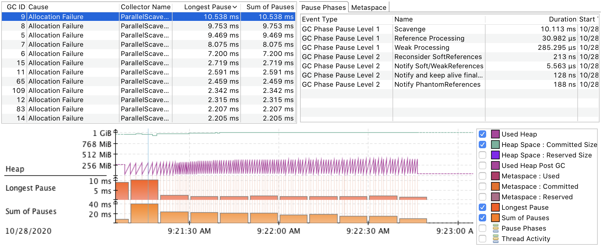

# 周四

## 第1题

### 描述

使用GCLogAnalysis.java自己演练一遍串行/并行/CMS/G1的案例。

### 解答

```
$ sysctl -a |egrep 'machdep.*cpu.*count'
machdep.cpu.core_count: 4
machdep.cpu.thread_count: 8

$ java -version
openjdk version "1.8.0_265"
OpenJDK Runtime Environment (Zulu 8.48.0.53-CA-macosx) (build 1.8.0_265-b11)
OpenJDK 64-Bit Server VM (Zulu 8.48.0.53-CA-macosx) (build 25.265-b11, mixed mode)

$ javac GCLogAnalysis.java
```

#### ParallelGC

##### default

###### 执行

```
$ java -XX:+PrintGCDetails -XX:+PrintGCDateStamps -Xloggc:gc_log/parallel_default.log GCLogAnalysis
正在执行...
执行结束!共生成对象次数:11547
```

###### 日志

```
OpenJDK 64-Bit Server VM (25.265-b11) for bsd-amd64 JRE (Zulu 8.48.0.53-CA-macosx) (1.8.0_265-b11), built on Jul 28 2020 03:07:54 by "zulu_re" with gcc 4.2.1 (Based on Apple Inc. build 5658) (LLVM build 2336.11.00)
Memory: 4k page, physical 16777216k(1653692k free)

/proc/meminfo:

CommandLine flags: -XX:InitialHeapSize=268435456 -XX:MaxHeapSize=4294967296 -XX:+PrintGC -XX:+PrintGCDateStamps -XX:+PrintGCDetails -XX:+PrintGCTimeStamps -XX:+UseCompressedClassPointers -XX:+UseCompressedOops -XX:+UseParallelGC
2020-10-24T15:51:37.787-0800: 0.125: [GC (Allocation Failure) [PSYoungGen: 65536K->10733K(76288K)] 65536K->21164K(251392K), 0.0072218 secs] [Times: user=0.01 sys=0.03, real=0.01 secs]
2020-10-24T15:51:37.805-0800: 0.143: [GC (Allocation Failure) [PSYoungGen: 76116K->10743K(141824K)] 86547K->43177K(316928K), 0.0125974 secs] [Times: user=0.02 sys=0.07, real=0.01 secs]
2020-10-24T15:51:37.853-0800: 0.190: [GC (Allocation Failure) [PSYoungGen: 141815K->10748K(141824K)] 174249K->88850K(316928K), 0.0194465 secs] [Times: user=0.02 sys=0.09, real=0.02 secs]
2020-10-24T15:51:37.889-0800: 0.226: [GC (Allocation Failure) [PSYoungGen: 141820K->10744K(272896K)] 219922K->131910K(448000K), 0.0198885 secs] [Times: user=0.02 sys=0.11, real=0.02 secs]
2020-10-24T15:51:37.909-0800: 0.246: [Full GC (Ergonomics) [PSYoungGen: 10744K->0K(272896K)] [ParOldGen: 121165K->118697K(250368K)] 131910K->118697K(523264K), [Metaspace: 2892K->2892K(1056768K)], 0.0113840 secs] [Times: user=0.07 sys=0.00, real=0.02 secs]
2020-10-24T15:51:37.995-0800: 0.333: [GC (Allocation Failure) [PSYoungGen: 262144K->10748K(272896K)] 380841K->207562K(523264K), 0.0321293 secs] [Times: user=0.04 sys=0.15, real=0.03 secs]
2020-10-24T15:51:38.027-0800: 0.365: [Full GC (Ergonomics) [PSYoungGen: 10748K->0K(272896K)] [ParOldGen: 196813K->183894K(358912K)] 207562K->183894K(631808K), [Metaspace: 2892K->2892K(1056768K)], 0.0195594 secs] [Times: user=0.11 sys=0.01, real=0.02 secs]
2020-10-24T15:51:38.089-0800: 0.427: [GC (Allocation Failure) [PSYoungGen: 262144K->86459K(560640K)] 446038K->270353K(919552K), 0.0318742 secs] [Times: user=0.03 sys=0.15, real=0.04 secs]
2020-10-24T15:51:38.250-0800: 0.588: [GC (Allocation Failure) [PSYoungGen: 552891K->109559K(576000K)] 736785K->370242K(934912K), 0.0630093 secs] [Times: user=0.08 sys=0.32, real=0.06 secs]
2020-10-24T15:51:38.367-0800: 0.704: [GC (Allocation Failure) [PSYoungGen: 575991K->167419K(953344K)] 836674K->458476K(1312256K), 0.0719556 secs] [Times: user=0.08 sys=0.37, real=0.07 secs]
2020-10-24T15:51:38.439-0800: 0.776: [Full GC (Ergonomics) [PSYoungGen: 167419K->0K(953344K)] [ParOldGen: 291057K->307144K(496640K)] 458476K->307144K(1449984K), [Metaspace: 2892K->2892K(1056768K)], 0.0361146 secs] [Times: user=0.18 sys=0.02, real=0.04 secs]
2020-10-24T15:51:38.624-0800: 0.962: [GC (Allocation Failure) [PSYoungGen: 785920K->205574K(995840K)] 1093064K->512719K(1492480K), 0.0742238 secs] [Times: user=0.08 sys=0.39, real=0.07 secs]
Heap
 PSYoungGen      total 995840K, used 623776K [0x000000076ab00000, 0x00000007c0000000, 0x00000007c0000000)
  eden space 785920K, 53% used [0x000000076ab00000,0x00000007843668c0,0x000000079aa80000)
  from space 209920K, 97% used [0x000000079aa80000,0x00000007a7341ac0,0x00000007a7780000)
  to   space 243712K, 0% used [0x00000007b1200000,0x00000007b1200000,0x00000007c0000000)
 ParOldGen       total 496640K, used 307144K [0x00000006c0000000, 0x00000006de500000, 0x000000076ab00000)
  object space 496640K, 61% used [0x00000006c0000000,0x00000006d2bf21a0,0x00000006de500000)
 Metaspace       used 2899K, capacity 4486K, committed 4864K, reserved 1056768K
  class space    used 309K, capacity 386K, committed 512K, reserved 1048576K
```

###### 分析

1. Memory: 4k page, physical 16777216k(1653692k free)

   - 内存页大小为4K
   - 物理内存大小为16777216k（16GB）

2. -XX:InitialHeapSize=268435456 -XX:MaxHeapSize=4294967296

   - 初始Heap大小为268435456 Bytes（256MB），默认为物理内存的1/64
   - 最大Heap大小为4294967296 Bytes（4GB），默认为物理内存的/1/4

3. -XX:+UseCompressedClassPointers -XX:+UseCompressedOops

   - klass pointer从8 Bytes压缩到4 Bytes，提升内存利用率

   - UseCompressedOops

     - 普通对象指针压缩

   - UseCompressedClassPointers

     - 类指针压缩

     - 依赖UseCompressedOops

       - UseCompressedOops must be on for UseCompressedClassPointers to be on.

4. -XX:+UseParallelGC
- 默认采用并行GC
  
5. 总共发生了9次Young GC和3次Full GC，并且没有连续的Full GC，下面仅分析第1次Young GC和第1次Full GC

6. Young GC

   - 2020-10-24T15:51:37.787-0800: 0.125
     - GC发生的时间戳

   - GC (Allocation Failure)
     - GC类型为Young GC
     - 触发GC的原因为Allocation Failure
   - PSYoungGen: 65536K->10733K(76288K)
     - Young区容量为76288K（74.5MB）
     - Young区经过Young GC后，从65536K（64MB）降到10733K（10.5MB），回收了83.6%的对象
       - 由于并行GC会导致STW，而且Young = Eden + From = Eden + To，从而可以推算出To区为10.5MB，Eden区为64MB
   - 65536K->21164K(251392K)
     - Heap容量为251392K（245.5MB = InitialHeapSize - To = Young + Old = 256MB - 10.5MB）
       - 从而可以简单推算出Old区为171MB
     - Heap经过Young GC后，从65536K（64MB，其实就是Eden区对象）降到21164K（20.7MB），回收了67.7%的对象
     - 对比Young区的回收情况，有10431K（10.2MB ≈ 21164K - 10733K）晋升到了Old区
   - Times: user=0.01 sys=0.03, real=0.01 secs
     - GC在用户态消耗的CPU时间为0.01秒
     - GC在内核态消耗的CPU时间为0.03秒
     - GC实际消耗的时间为0.01秒（精确值为0.0072218秒）
     - user + sys > real
       - 多核CPU

7. Full GC

   - 2020-10-24T15:51:37.909-0800: 0.246
     - GC发生的时间戳
   - Full GC (Ergonomics)
     - GC类型为Full GC (Ergonomics)
     - Ergonomics（automatic tuning，相关资料参照下文）
   - PSYoungGen: 10744K->0K(272896K)
     - Young区容量为272896K（266.5MB）
     - Young区经过Full GC后，从10744K（10.5MB）降到0K（0MB），回收了100%的对象
   - ParOldGen: 121165K->118697K(250368K)
     - Old区容量为250368K（244.5MB）
     - Old区经过Full GC后，从121165K（118.3MB）降到118697K（115.9MB），回收了2%的对象
   - 131910K->118697K(523264K)
     - Heap容量为523264K（511MB = Young + Old = 266.5MB + 244.5MB）
     - Heap经过Full GC后，从131910K（128.8MB = 10.5MB + 118.3MB）降到118697K（115.9MB = 0MB + 115.9MB），回收了10%的对象
   - Metaspace: 2892K->2892K(1056768K)
     - Meta区容量为1056768K（1032MB）
     - Meta区经过Full GC后，空间没有变化
       - 因为Meta区只占用了2892K，远低于MetaspaceSize的默认值（21807104K ≈ 20.8MB）
   - Times: user=0.07 sys=0.00, real=0.02 secs
     - GC在用户态消耗的CPU时间为0.07秒
     - GC在内核态消耗的CPU时间为0.00秒
     - GC实际消耗的时间为0.02秒（精确值为0.0113840秒）
     - user + sys > real
       - 多核CPU

8. JVM进程退出前的内存布局

   - Young区
     - PSYoungGen      total 995840K, used 623776K
       - Young区容量995840K（972.5MB），使用了623776K（608.2MB，62.7%）
     - eden space 785920K, 53% used
       - Eden区容量785920K（767.5MB），使用了53%（416538K ≈ 406.8MB）
     - from space 209920K, 97% used
       - From区容量为209920K（205MB），使用了97%（203622K ≈ 198.9MB）
       - Young = Eden + From
         - 995840K = 785920K +  209920K
         - 623776K ≈ 785920K × 0.53 + 209920K × 0.97 = 620160K
     - to   space 243712K, 0% used
       - To区容量为243712K（238MB），使用了0%
       - From ≈ To
   - Old区
     - ParOldGen       total 496640K, used 307144K（object space 496640K, 61% used）
       - Old区容量为496640K（485MB），使用了307144K（299.9MB，61.8%）
       - Old区没有再继续细分，所有显示为object space
   - Meta区
     -  Metaspace       used 2899K, capacity 4486K, committed 4864K, reserved 1056768K
       - Meta区已经申请的虚拟地址空间为1056768K（1032MB），操作系统实际分配的物理内存为4864K（4.75MB）
       - 容量为4486K（4.38MB），使用了2899K（2.83MB，64.6%）
     - class space    used 309K, capacity 386K, committed 512K, reserved 1048576K
       - CCS区已经申请的虚拟地址空间为1048576K（1GB），操作系统实际分配的物理内存为512K
       - 容量为386K，使用了309K（80%）

**GC Statistics**


**Object Stats**


**GC Causes**


**user sys real**

[What do 'real', 'user' and 'sys' mean in the output of time(1)?](https://stackoverflow.com/questions/556405/what-do-real-user-and-sys-mean-in-the-output-of-time1)

User

> **User** is the amount of CPU time spent in user-mode code (outside the kernel) within the process. This is only actual CPU time used in executing the process. Other processes and time the process spends blocked do not count towards this figure.

Sys

> **Sys** is the amount of CPU time spent in the kernel within the process. This means executing CPU time spent in system calls within the kernel, as opposed to library code, which is still running in user-space. Like 'user', this is only CPU time used by the process.

Real

> **Real** is wall clock time - time from start to finish of the call. This is all elapsed time including time slices used by other processes and time the process spends blocked (for example if it is waiting for I/O to complete).

**Ergonomics**

[6 The Parallel Collector](https://docs.oracle.com/javase/8/docs/technotes/guides/vm/gctuning/parallel.html)

> The parallel collector is selected by default on server-class machines. In addition, the parallel collector uses a method of automatic tuning that allows you to specify specific behaviors instead of generation sizes and other low-level tuning details. You can specify maximum garbage collection pause time, throughput, and footprint (heap size).

Maximum Garbage Collection Pause Time

> The maximum pause time goal is specified with the command-line option `-XX:MaxGCPauseMillis=<N>`. This is interpreted as a hint that pause times of `<N>` milliseconds or less are desired; by default, there is no maximum pause time goal. If a pause time goal is specified, the heap size and other parameters related to garbage collection are adjusted in an attempt to keep garbage collection pauses shorter than the specified value. These adjustments may cause the garbage collector to reduce the overall throughput of the application, and the desired pause time goal cannot always be met.

Throughput

> The throughput goal is measured in terms of the time spent doing garbage collection versus the time spent outside of garbage collection (referred to as application time). The goal is specified by the command-line option `-XX:GCTimeRatio=<N>`, which sets the ratio of garbage collection time to application time to `1 / (1 +<N>)`.
>
> For example, `-XX:GCTimeRatio=19` sets a goal of 1/20 or 5% of the total time in garbage collection. The default value is 99, resulting in a goal of 1% of the time in garbage collection.

Footprint

> Maximum heap footprint is specified using the option `-Xmx<N>`. In addition, the collector has an implicit goal of minimizing the size of the heap as long as the other goals are being met.

##### 256m

###### 执行

```
$ java -XX:+PrintGCDetails -XX:+PrintGCDateStamps -Xloggc:gc_log/parallel_256.log -Xms256m -Xmx256m GCLogAnalysis
正在执行...
Exception in thread "main" java.lang.OutOfMemoryError: Java heap space
	at GCLogAnalysis.generateGarbage(GCLogAnalysis.java:50)
	at GCLogAnalysis.main(GCLogAnalysis.java:27)
```

###### 日志

```
OpenJDK 64-Bit Server VM (25.265-b11) for bsd-amd64 JRE (Zulu 8.48.0.53-CA-macosx) (1.8.0_265-b11), built on Jul 28 2020 03:07:54 by "zulu_re" with gcc 4.2.1 (Based on Apple Inc. build 5658) (LLVM build 2336.11.00)
Memory: 4k page, physical 16777216k(1641796k free)

/proc/meminfo:

CommandLine flags: -XX:InitialHeapSize=268435456 -XX:MaxHeapSize=268435456 -XX:+PrintGC -XX:+PrintGCDateStamps -XX:+PrintGCDetails -XX:+PrintGCTimeStamps -XX:+UseCompressedClassPointers -XX:+UseCompressedOops -XX:+UseParallelGC
2020-10-24T21:06:51.065-0800: 0.134: [GC (Allocation Failure) [PSYoungGen: 65536K->10743K(76288K)] 65536K->23377K(251392K), 0.0085607 secs] [Times: user=0.01 sys=0.04, real=0.01 secs]
2020-10-24T21:06:51.085-0800: 0.155: [GC (Allocation Failure) [PSYoungGen: 76279K->10739K(76288K)] 88913K->47189K(251392K), 0.0129632 secs] [Times: user=0.02 sys=0.07, real=0.01 secs]
2020-10-24T21:06:51.106-0800: 0.176: [GC (Allocation Failure) [PSYoungGen: 76173K->10743K(76288K)] 112624K->72793K(251392K), 0.0104206 secs] [Times: user=0.01 sys=0.04, real=0.01 secs]
2020-10-24T21:06:51.124-0800: 0.194: [GC (Allocation Failure) [PSYoungGen: 76279K->10741K(76288K)] 138329K->92704K(251392K), 0.0088805 secs] [Times: user=0.02 sys=0.04, real=0.01 secs]
2020-10-24T21:06:51.142-0800: 0.212: [GC (Allocation Failure) [PSYoungGen: 76163K->10747K(76288K)] 158125K->115392K(251392K), 0.0102026 secs] [Times: user=0.01 sys=0.05, real=0.01 secs]
2020-10-24T21:06:51.160-0800: 0.229: [GC (Allocation Failure) [PSYoungGen: 76221K->10749K(40448K)] 180865K->140109K(215552K), 0.0098795 secs] [Times: user=0.02 sys=0.04, real=0.01 secs]
2020-10-24T21:06:51.173-0800: 0.243: [GC (Allocation Failure) [PSYoungGen: 40138K->17927K(58368K)] 169499K->151877K(233472K), 0.0021099 secs] [Times: user=0.01 sys=0.00, real=0.00 secs]
2020-10-24T21:06:51.179-0800: 0.249: [GC (Allocation Failure) [PSYoungGen: 47567K->26158K(58368K)] 181517K->163833K(233472K), 0.0029516 secs] [Times: user=0.02 sys=0.01, real=0.01 secs]
2020-10-24T21:06:51.185-0800: 0.255: [GC (Allocation Failure) [PSYoungGen: 55826K->28651K(58368K)] 193502K->174056K(233472K), 0.0043213 secs] [Times: user=0.01 sys=0.01, real=0.01 secs]
2020-10-24T21:06:51.190-0800: 0.260: [Full GC (Ergonomics) [PSYoungGen: 28651K->0K(58368K)] [ParOldGen: 145405K->155602K(175104K)] 174056K->155602K(233472K), [Metaspace: 2892K->2892K(1056768K)], 0.0176453 secs] [Times: user=0.09 sys=0.02, real=0.01 secs]
2020-10-24T21:06:51.212-0800: 0.281: [Full GC (Ergonomics) [PSYoungGen: 29294K->0K(58368K)] [ParOldGen: 155602K->162384K(175104K)] 184896K->162384K(233472K), [Metaspace: 2892K->2892K(1056768K)], 0.0165632 secs] [Times: user=0.08 sys=0.01, real=0.01 secs]
2020-10-24T21:06:51.234-0800: 0.304: [Full GC (Ergonomics) [PSYoungGen: 29696K->0K(58368K)] [ParOldGen: 162384K->166761K(175104K)] 192080K->166761K(233472K), [Metaspace: 2892K->2892K(1056768K)], 0.0172991 secs] [Times: user=0.10 sys=0.01, real=0.02 secs]
2020-10-24T21:06:51.256-0800: 0.326: [Full GC (Ergonomics) [PSYoungGen: 29696K->0K(58368K)] [ParOldGen: 166761K->173804K(175104K)] 196457K->173804K(233472K), [Metaspace: 2892K->2892K(1056768K)], 0.0178451 secs] [Times: user=0.10 sys=0.02, real=0.02 secs]
2020-10-24T21:06:51.279-0800: 0.349: [Full GC (Ergonomics) [PSYoungGen: 29689K->6484K(58368K)] [ParOldGen: 173804K->174924K(175104K)] 203493K->181409K(233472K), [Metaspace: 2892K->2892K(1056768K)], 0.0192671 secs] [Times: user=0.11 sys=0.00, real=0.02 secs]
2020-10-24T21:06:51.303-0800: 0.373: [Full GC (Ergonomics) [PSYoungGen: 29696K->10148K(58368K)] [ParOldGen: 174924K->174464K(175104K)] 204620K->184612K(233472K), [Metaspace: 2892K->2892K(1056768K)], 0.0189544 secs] [Times: user=0.11 sys=0.00, real=0.02 secs]
2020-10-24T21:06:51.326-0800: 0.396: [Full GC (Ergonomics) [PSYoungGen: 29692K->14001K(58368K)] [ParOldGen: 174464K->174977K(175104K)] 204156K->188978K(233472K), [Metaspace: 2892K->2892K(1056768K)], 0.0197305 secs] [Times: user=0.13 sys=0.00, real=0.02 secs]
2020-10-24T21:06:51.349-0800: 0.418: [Full GC (Ergonomics) [PSYoungGen: 29451K->17911K(58368K)] [ParOldGen: 174977K->174508K(175104K)] 204428K->192419K(233472K), [Metaspace: 2892K->2892K(1056768K)], 0.0207601 secs] [Times: user=0.12 sys=0.01, real=0.03 secs]
2020-10-24T21:06:51.371-0800: 0.441: [Full GC (Ergonomics) [PSYoungGen: 29696K->19583K(58368K)] [ParOldGen: 174508K->174521K(175104K)] 204204K->194104K(233472K), [Metaspace: 2892K->2892K(1056768K)], 0.0184822 secs] [Times: user=0.11 sys=0.00, real=0.02 secs]
2020-10-24T21:06:51.392-0800: 0.461: [Full GC (Ergonomics) [PSYoungGen: 29696K->18754K(58368K)] [ParOldGen: 174521K->174810K(175104K)] 204217K->193564K(233472K), [Metaspace: 2892K->2892K(1056768K)], 0.0188716 secs] [Times: user=0.12 sys=0.00, real=0.02 secs]
2020-10-24T21:06:51.412-0800: 0.482: [Full GC (Ergonomics) [PSYoungGen: 29695K->22727K(58368K)] [ParOldGen: 174810K->174521K(175104K)] 204505K->197248K(233472K), [Metaspace: 2892K->2892K(1056768K)], 0.0242051 secs] [Times: user=0.15 sys=0.00, real=0.02 secs]
2020-10-24T21:06:51.438-0800: 0.507: [Full GC (Ergonomics) [PSYoungGen: 29693K->22947K(58368K)] [ParOldGen: 174521K->174898K(175104K)] 204215K->197845K(233472K), [Metaspace: 2892K->2892K(1056768K)], 0.0236721 secs] [Times: user=0.16 sys=0.00, real=0.03 secs]
2020-10-24T21:06:51.463-0800: 0.532: [Full GC (Ergonomics) [PSYoungGen: 29685K->23036K(58368K)] [ParOldGen: 174898K->174953K(175104K)] 204583K->197990K(233472K), [Metaspace: 2892K->2892K(1056768K)], 0.0195883 secs] [Times: user=0.12 sys=0.00, real=0.02 secs]
2020-10-24T21:06:51.484-0800: 0.553: [Full GC (Ergonomics) [PSYoungGen: 29681K->22246K(58368K)] [ParOldGen: 174953K->175036K(175104K)] 204635K->197283K(233472K), [Metaspace: 2892K->2892K(1056768K)], 0.0195309 secs] [Times: user=0.12 sys=0.00, real=0.02 secs]
2020-10-24T21:06:51.504-0800: 0.574: [Full GC (Ergonomics) [PSYoungGen: 29661K->24284K(58368K)] [ParOldGen: 175036K->175029K(175104K)] 204697K->199314K(233472K), [Metaspace: 2892K->2892K(1056768K)], 0.0186212 secs] [Times: user=0.12 sys=0.01, real=0.02 secs]
2020-10-24T21:06:51.524-0800: 0.594: [Full GC (Ergonomics) [PSYoungGen: 29627K->25639K(58368K)] [ParOldGen: 175029K->175018K(175104K)] 204657K->200658K(233472K), [Metaspace: 2892K->2892K(1056768K)], 0.0122496 secs] [Times: user=0.08 sys=0.00, real=0.01 secs]
2020-10-24T21:06:51.537-0800: 0.607: [Full GC (Ergonomics) [PSYoungGen: 29696K->25735K(58368K)] [ParOldGen: 175018K->174989K(175104K)] 204714K->200725K(233472K), [Metaspace: 2892K->2892K(1056768K)], 0.0128341 secs] [Times: user=0.08 sys=0.00, real=0.02 secs]
2020-10-24T21:06:51.551-0800: 0.621: [Full GC (Ergonomics) [PSYoungGen: 29643K->26366K(58368K)] [ParOldGen: 174989K->175096K(175104K)] 204632K->201462K(233472K), [Metaspace: 2892K->2892K(1056768K)], 0.0062705 secs] [Times: user=0.04 sys=0.00, real=0.00 secs]
2020-10-24T21:06:51.558-0800: 0.627: [Full GC (Ergonomics) [PSYoungGen: 29542K->27738K(58368K)] [ParOldGen: 175096K->174997K(175104K)] 204639K->202735K(233472K), [Metaspace: 2892K->2892K(1056768K)], 0.0238922 secs] [Times: user=0.13 sys=0.00, real=0.03 secs]
2020-10-24T21:06:51.582-0800: 0.652: [Full GC (Ergonomics) [PSYoungGen: 29573K->28115K(58368K)] [ParOldGen: 174997K->174997K(175104K)] 204570K->203112K(233472K), [Metaspace: 2892K->2892K(1056768K)], 0.0034332 secs] [Times: user=0.01 sys=0.00, real=0.00 secs]
2020-10-24T21:06:51.586-0800: 0.656: [Full GC (Ergonomics) [PSYoungGen: 29525K->28449K(58368K)] [ParOldGen: 174997K->174628K(175104K)] 204522K->203077K(233472K), [Metaspace: 2892K->2892K(1056768K)], 0.0051581 secs] [Times: user=0.02 sys=0.00, real=0.01 secs]
2020-10-24T21:06:51.591-0800: 0.661: [Full GC (Ergonomics) [PSYoungGen: 29421K->28792K(58368K)] [ParOldGen: 174628K->174628K(175104K)] 204049K->203420K(233472K), [Metaspace: 2892K->2892K(1056768K)], 0.0022134 secs] [Times: user=0.01 sys=0.00, real=0.00 secs]
2020-10-24T21:06:51.594-0800: 0.663: [Full GC (Ergonomics) [PSYoungGen: 29559K->28936K(58368K)] [ParOldGen: 174628K->174628K(175104K)] 204187K->203564K(233472K), [Metaspace: 2892K->2892K(1056768K)], 0.0019199 secs] [Times: user=0.00 sys=0.00, real=0.00 secs]
2020-10-24T21:06:51.596-0800: 0.666: [Full GC (Ergonomics) [PSYoungGen: 29456K->28988K(58368K)] [ParOldGen: 174628K->174628K(175104K)] 204084K->203616K(233472K), [Metaspace: 2892K->2892K(1056768K)], 0.0019255 secs] [Times: user=0.01 sys=0.00, real=0.00 secs]
2020-10-24T21:06:51.598-0800: 0.668: [Full GC (Allocation Failure) [PSYoungGen: 28988K->28988K(58368K)] [ParOldGen: 174628K->174609K(175104K)] 203616K->203597K(233472K), [Metaspace: 2892K->2892K(1056768K)], 0.0294956 secs] [Times: user=0.18 sys=0.00, real=0.03 secs]
Heap
 PSYoungGen      total 58368K, used 29609K [0x00000007bab00000, 0x00000007c0000000, 0x00000007c0000000)
  eden space 29696K, 99% used [0x00000007bab00000,0x00000007bc7ea640,0x00000007bc800000)
  from space 28672K, 0% used [0x00000007bc800000,0x00000007bc800000,0x00000007be400000)
  to   space 28672K, 0% used [0x00000007be400000,0x00000007be400000,0x00000007c0000000)
 ParOldGen       total 175104K, used 174609K [0x00000007b0000000, 0x00000007bab00000, 0x00000007bab00000)
  object space 175104K, 99% used [0x00000007b0000000,0x00000007baa84498,0x00000007bab00000)
 Metaspace       used 2923K, capacity 4486K, committed 4864K, reserved 1056768K
  class space    used 311K, capacity 386K, committed 512K, reserved 1048576K
```

###### 分析

1. 执行了9次Young GC和25次Full GC（连续25次，且最后一次Full GC失败的原因是Allocation Failure，直接OOM）
2. 第1次Full GC到第4次Full GC不但没有回收Old区，反而从Young区晋升了更多的对象
3. 第5次Full GC到第25次Full GC基本无法回收Old区，由于无法晋升到Old区，Young区只能不断增长，最终导致了OOM
4. 从JVM进程退出前的内存布局可知，Eden区使用了99%，Old区也使用了99%
   - Old区无法回收，且To区无法容纳Eden区所有的存活对象，最终导致了Eden区无法分配新对象，最终导致了OOM

**Heap After GC**

Full GC基本没有回收多少空间


**GC Statistics**


**Object Stats**


**GC Causes**


##### 对比

|                                        | default     | 4096m      | 2048m       | 1024m       | 512m        | 256m     |
| -------------------------------------- | ----------- | ---------- | ----------- | ----------- | ----------- | -------- |
| Create Objects                         | 11547       | 11819      | 12610       | 12483       | 7659        | -        |
| Minor GC count                         | 9           | 3          | 7           | 21          | 19          | 9        |
| Minor GC min/max time (ms)             | 10.0 / 70.0 | 80.0 / 110 | 10.0 / 70.0 | 0 / 40.0    | 0 / 20.0    | 0 / 10.0 |
| Full GC Count                          | 3           | 0          | 0           | 1           | 12          | 25       |
| Full GC min/max time (ms)              | 20.0 / 40.0 | -          | -           | 50.0 / 50.0 | 30.0 / 40.0 | 0 / 30.0 |
| Pause Count                            | 12          | 3          | 7           | 22          | 31          | 34       |
| Pause total time (ms)                  | 410         | 270        | 360         | 430         | 620         | 480      |
| Avg creation rate (gb/sec)             | 3           | 6.59       | 4.55        | 3.71        | 2.23        | 1.33     |
| Avg promotion rate (mb/sec)            | 357.54      | 709.38     | 903.16      | 987.73      | 467.18      | 266.42   |
| (1- pause) * log(creation / promotion) | 0.5450      | 0.7066     | 0.4494      | 0.3275      | 0.2579      | -        |
| 备注                                   |             | Best       |             |             |             | OOM      |

#### SerialGC

##### default

###### 命令

```
$ java -XX:+PrintGCDetails -XX:+PrintGCDateStamps -XX:+UseSerialGC -Xloggc:gc_log/serial_default.log GCLogAnalysis
正在执行...
执行结束!共生成对象次数:9105
```

###### 日志

```
OpenJDK 64-Bit Server VM (25.265-b11) for bsd-amd64 JRE (Zulu 8.48.0.53-CA-macosx) (1.8.0_265-b11), built on Jul 28 2020 03:07:54 by "zulu_re" with gcc 4.2.1 (Based on Apple Inc. build 5658) (LLVM build 2336.11.00)
Memory: 4k page, physical 16777216k(27900k free)

/proc/meminfo:

CommandLine flags: -XX:InitialHeapSize=268435456 -XX:MaxHeapSize=4294967296 -XX:+PrintGC -XX:+PrintGCDateStamps -XX:+PrintGCDetails -XX:+PrintGCTimeStamps -XX:+UseCompressedClassPointers -XX:+UseCompressedOops -XX:+UseSerialGC
2020-10-24T22:50:00.209-0800: 0.171: [GC (Allocation Failure) 2020-10-24T22:50:00.209-0800: 0.171: [DefNew: 69770K->8704K(78656K), 0.0167116 secs] 69770K->23561K(253440K), 0.0168579 secs] [Times: user=0.01 sys=0.00, real=0.02 secs]
2020-10-24T22:50:00.239-0800: 0.201: [GC (Allocation Failure) 2020-10-24T22:50:00.239-0800: 0.201: [DefNew: 78568K->8696K(78656K), 0.0203654 secs] 93425K->45195K(253440K), 0.0204603 secs] [Times: user=0.01 sys=0.00, real=0.03 secs]
2020-10-24T22:50:00.268-0800: 0.229: [GC (Allocation Failure) 2020-10-24T22:50:00.268-0800: 0.229: [DefNew: 78648K->8702K(78656K), 0.0177235 secs] 115147K->69057K(253440K), 0.0178036 secs] [Times: user=0.01 sys=0.01, real=0.02 secs]
2020-10-24T22:50:00.295-0800: 0.257: [GC (Allocation Failure) 2020-10-24T22:50:00.295-0800: 0.257: [DefNew: 78550K->8701K(78656K), 0.0145468 secs] 138904K->89206K(253440K), 0.0146303 secs] [Times: user=0.00 sys=0.01, real=0.02 secs]
2020-10-24T22:50:00.320-0800: 0.281: [GC (Allocation Failure) 2020-10-24T22:50:00.320-0800: 0.281: [DefNew: 78653K->8699K(78656K), 0.0165465 secs] 159158K->114132K(253440K), 0.0166275 secs] [Times: user=0.01 sys=0.00, real=0.01 secs]
2020-10-24T22:50:00.346-0800: 0.308: [GC (Allocation Failure) 2020-10-24T22:50:00.346-0800: 0.308: [DefNew: 78651K->8703K(78656K), 0.0155677 secs] 184084K->136176K(253440K), 0.0156476 secs] [Times: user=0.01 sys=0.01, real=0.02 secs]
2020-10-24T22:50:00.371-0800: 0.333: [GC (Allocation Failure) 2020-10-24T22:50:00.371-0800: 0.333: [DefNew: 78571K->8701K(78656K), 0.0149883 secs] 206043K->159091K(253440K), 0.0150656 secs] [Times: user=0.01 sys=0.01, real=0.01 secs]
2020-10-24T22:50:00.395-0800: 0.357: [GC (Allocation Failure) 2020-10-24T22:50:00.395-0800: 0.357: [DefNew: 78653K->8699K(78656K), 0.0185561 secs]2020-10-24T22:50:00.414-0800: 0.375: [Tenured: 175155K->161023K(175168K), 0.0296649 secs] 229043K->161023K(253824K), [Metaspace: 2892K->2892K(1056768K)], 0.0485336 secs] [Times: user=0.04 sys=0.00, real=0.05 secs]
2020-10-24T22:50:00.470-0800: 0.432: [GC (Allocation Failure) 2020-10-24T22:50:00.470-0800: 0.432: [DefNew: 107456K->13375K(120832K), 0.0186722 secs] 268479K->199318K(389208K), 0.0187701 secs] [Times: user=0.01 sys=0.01, real=0.01 secs]
2020-10-24T22:50:00.505-0800: 0.466: [GC (Allocation Failure) 2020-10-24T22:50:00.505-0800: 0.466: [DefNew: 120755K->13375K(120832K), 0.0283379 secs] 306699K->233747K(389208K), 0.0284681 secs] [Times: user=0.02 sys=0.01, real=0.03 secs]
2020-10-24T22:50:00.546-0800: 0.507: [GC (Allocation Failure) 2020-10-24T22:50:00.546-0800: 0.507: [DefNew: 120831K->13370K(120832K), 0.0237774 secs] 341203K->264907K(389208K), 0.0238661 secs] [Times: user=0.01 sys=0.01, real=0.03 secs]
2020-10-24T22:50:00.583-0800: 0.544: [GC (Allocation Failure) 2020-10-24T22:50:00.583-0800: 0.544: [DefNew: 120826K->13375K(120832K), 0.0243821 secs]2020-10-24T22:50:00.607-0800: 0.569: [Tenured: 287283K->251154K(287360K), 0.0388825 secs] 372363K->251154K(408192K), [Metaspace: 2892K->2892K(1056768K)], 0.0637057 secs] [Times: user=0.06 sys=0.01, real=0.06 secs]
2020-10-24T22:50:00.683-0800: 0.644: [GC (Allocation Failure) 2020-10-24T22:50:00.683-0800: 0.644: [DefNew: 167488K->20928K(188416K), 0.0196327 secs] 418642K->300181K(607008K), 0.0197226 secs] [Times: user=0.02 sys=0.00, real=0.02 secs]
2020-10-24T22:50:00.725-0800: 0.686: [GC (Allocation Failure) 2020-10-24T22:50:00.725-0800: 0.686: [DefNew: 188416K->20926K(188416K), 0.0408684 secs] 467669K->351314K(607008K), 0.0409512 secs] [Times: user=0.02 sys=0.01, real=0.04 secs]
2020-10-24T22:50:00.786-0800: 0.748: [GC (Allocation Failure) 2020-10-24T22:50:00.786-0800: 0.748: [DefNew: 188414K->20927K(188416K), 0.0336036 secs] 518802K->400071K(607008K), 0.0337492 secs] [Times: user=0.02 sys=0.02, real=0.04 secs]
2020-10-24T22:50:00.838-0800: 0.800: [GC (Allocation Failure) 2020-10-24T22:50:00.838-0800: 0.800: [DefNew: 188415K->20927K(188416K), 0.0394888 secs]2020-10-24T22:50:00.878-0800: 0.839: [Tenured: 433937K->324101K(434004K), 0.0648031 secs] 567559K->324101K(622420K), [Metaspace: 2892K->2892K(1056768K)], 0.1046629 secs] [Times: user=0.08 sys=0.01, real=0.11 secs]
2020-10-24T22:50:00.975-0800: 0.936: [GC (Allocation Failure) 2020-10-24T22:50:00.975-0800: 0.936: [DefNew: 216128K->27006K(243136K), 0.0256124 secs] 540229K->401319K(783308K), 0.0256951 secs] [Times: user=0.02 sys=0.01, real=0.03 secs]
2020-10-24T22:50:01.031-0800: 0.993: [GC (Allocation Failure) 2020-10-24T22:50:01.031-0800: 0.993: [DefNew: 243134K->27005K(243136K), 0.0292236 secs] 617447K->464337K(783308K), 0.0293151 secs] [Times: user=0.02 sys=0.01, real=0.03 secs]
2020-10-24T22:50:01.086-0800: 1.048: [GC (Allocation Failure) 2020-10-24T22:50:01.086-0800: 1.048: [DefNew: 243133K->27007K(243136K), 0.0459375 secs] 680465K->526657K(783308K), 0.0460166 secs] [Times: user=0.03 sys=0.02, real=0.05 secs]
Heap
 def new generation   total 243136K, used 154331K [0x00000006c0000000, 0x00000006d07d0000, 0x0000000715550000)
  eden space 216128K,  58% used [0x00000006c0000000, 0x00000006c7c56fe8, 0x00000006cd310000)
  from space 27008K,  99% used [0x00000006ced70000, 0x00000006d07cffe8, 0x00000006d07d0000)
  to   space 27008K,   0% used [0x00000006cd310000, 0x00000006cd310000, 0x00000006ced70000)
 tenured generation   total 540172K, used 499649K [0x0000000715550000, 0x00000007364d3000, 0x00000007c0000000)
   the space 540172K,  92% used [0x0000000715550000, 0x0000000733d40760, 0x0000000733d40800, 0x00000007364d3000)
 Metaspace       used 2899K, capacity 4486K, committed 4864K, reserved 1056768K
  class space    used 309K, capacity 386K, committed 512K, reserved 1048576K
```

###### 分析

1. 执行了16次Young GC和3次Full GC，仅分析第1次Young GC和第1次Full GC

2. Young GC

   - Allocation Failure
     - 触发GC的原因
   - 2020-10-24T22:50:00.209-0800: 0.171
     - GC发生的时间

   - DefNew: 69770K->8704K(78656K)
     - Young区容量为78656K（76.8MB）
     - Young区经过Young GC后，从69770K（68.1MB）降到8704K（8.5MB），回收了87.5%的对象
       - 由于串行GC会导致STW，而且Young = Eden + From = Eden + To，从而可以推算出To区为8.5MB，Eden区为68.3MB
   - 69770K->23561K(253440K)
     - Heap容量为253440K（247.5MB = InitialHeapSize - To = Young + Old = 256MB - 8.5MB）
       - 从而可以简单推算出Old区为170.7MB
     - Heap经过Young GC后，从69770K（68.1MB < Eden = 68.3MB）降到23561K（23MB），回收了66.2%的对象
     - 对比Young区的回收情况，有14857K（14.5MB ≈ 23561K - 8704K）晋升到了Old区
   - 0.0168579 secs
     - Young GC耗时为0.0168579秒

3. Full GC

   - Allocation Failure
     - 触发GC的原因
   - 2020-10-24T22:50:00.395-0800: 0.357
     - 回收Young区的时间戳
   - DefNew: 78653K->8699K(78656K), 0.0185561 secs
     - Young区容量为78656K（76.8MB）
     - Young区经过回收后，从78653K（76.8MB）降到8699K（8.5MB），回收了88.9%的对象
       - 回收的目标为Eden+From，迁移或晋升的目标为To+Old
     - 实际耗时0.0185561秒，结束的时间戳为2020-10-24T22:50:00.41356 ≈ 2020-10-24T22:50:00.395+0.01856
       - 与下一阶段开始的时间很接近 -- 进一步印证了串行GC是单线程的
   - 2020-10-24T22:50:00.414-0800: 0.375
     - 回收Old区的时间戳
   - Tenured: 175155K->161023K(175168K), 0.0296649 secs
     - Old区容量为175168K（171.1MB）
     - Old区经过Full GC后，从175155K（171.0MB）降到161023K（157.2MB），回收了8%的对象
     - 实际耗时0.0296649秒
   - 229043K->161023K(253824K)
     - Heap容量为253824K（247.9MB = Young + Old = 76.8MB + 171.1MB）
     - Heap经过Full GC后，从229043K降到161023K，回收了29.7%的对象
   - Metaspace: 2892K->2892K(1056768K)
     - Meta区容量为1056768K（1032MB）
     - Meta区经过Full GC后，空间没有变化
       - 因为Meta区只占用了2892K，远低于MetaspaceSize的默认值（21807104K ≈ 20.8MB）
   - 0.0485336 secs
     - 实际耗时0.0485336秒 ≈ 回收Young区耗时 + 回收 Old区耗时 =  0.0185561秒 + 0.0296649秒 = 0.048221秒

##### 128m

###### 命令

```
$ java -XX:+PrintGCDetails -XX:+PrintGCDateStamps -XX:+UseSerialGC -Xloggc:gc_log/serial_128.log -Xms128m -Xmx128m GCLogAnalysis
正在执行...
Exception in thread "main" java.lang.OutOfMemoryError: Java heap space
	at GCLogAnalysis.generateGarbage(GCLogAnalysis.java:50)
	at GCLogAnalysis.main(GCLogAnalysis.java:27)
```

###### 日志

```
OpenJDK 64-Bit Server VM (25.265-b11) for bsd-amd64 JRE (Zulu 8.48.0.53-CA-macosx) (1.8.0_265-b11), built on Jul 28 2020 03:07:54 by "zulu_re" with gcc 4.2.1 (Based on Apple Inc. build 5658) (LLVM build 2336.11.00)
Memory: 4k page, physical 16777216k(667560k free)

/proc/meminfo:

CommandLine flags: -XX:InitialHeapSize=134217728 -XX:MaxHeapSize=134217728 -XX:+PrintGC -XX:+PrintGCDateStamps -XX:+PrintGCDetails -XX:+PrintGCTimeStamps -XX:+UseCompressedClassPointers -XX:+UseCompressedOops -XX:+UseSerialGC
2020-10-24T23:59:12.678-0800: 0.135: [GC (Allocation Failure) 2020-10-24T23:59:12.678-0800: 0.135: [DefNew: 34514K->4352K(39296K), 0.0086749 secs] 34514K->14050K(126720K), 0.0087644 secs] [Times: user=0.00 sys=0.00, real=0.01 secs]
2020-10-24T23:59:12.698-0800: 0.156: [GC (Allocation Failure) 2020-10-24T23:59:12.698-0800: 0.156: [DefNew: 38969K->4350K(39296K), 0.0096983 secs] 48667K->25985K(126720K), 0.0097661 secs] [Times: user=0.00 sys=0.01, real=0.01 secs]
2020-10-24T23:59:12.713-0800: 0.170: [GC (Allocation Failure) 2020-10-24T23:59:12.713-0800: 0.171: [DefNew: 39065K->4348K(39296K), 0.0089042 secs] 60700K->41614K(126720K), 0.0089697 secs] [Times: user=0.01 sys=0.00, real=0.01 secs]
2020-10-24T23:59:12.727-0800: 0.184: [GC (Allocation Failure) 2020-10-24T23:59:12.727-0800: 0.184: [DefNew: 39292K->4350K(39296K), 0.0056288 secs] 76558K->50807K(126720K), 0.0056891 secs] [Times: user=0.00 sys=0.01, real=0.01 secs]
2020-10-24T23:59:12.738-0800: 0.195: [GC (Allocation Failure) 2020-10-24T23:59:12.738-0800: 0.195: [DefNew: 39179K->4351K(39296K), 0.0083814 secs] 85637K->64253K(126720K), 0.0084454 secs] [Times: user=0.00 sys=0.00, real=0.01 secs]
2020-10-24T23:59:12.750-0800: 0.208: [GC (Allocation Failure) 2020-10-24T23:59:12.751-0800: 0.208: [DefNew: 39295K->4349K(39296K), 0.0071665 secs] 99197K->75567K(126720K), 0.0072277 secs] [Times: user=0.00 sys=0.00, real=0.00 secs]
2020-10-24T23:59:12.761-0800: 0.219: [GC (Allocation Failure) 2020-10-24T23:59:12.762-0800: 0.219: [DefNew: 39277K->39277K(39296K), 0.0000152 secs]2020-10-24T23:59:12.762-0800: 0.219: [Tenured: 71217K->86506K(87424K), 0.0164639 secs] 110495K->86506K(126720K), [Metaspace: 2892K->2892K(1056768K)], 0.0165557 secs] [Times: user=0.01 sys=0.01, real=0.01 secs]
2020-10-24T23:59:12.783-0800: 0.240: [GC (Allocation Failure) 2020-10-24T23:59:12.783-0800: 0.240: [DefNew: 34608K->34608K(39296K), 0.0000165 secs]2020-10-24T23:59:12.783-0800: 0.240: [Tenured: 86506K->87352K(87424K), 0.0098137 secs] 121115K->94034K(126720K), [Metaspace: 2892K->2892K(1056768K)], 0.0099141 secs] [Times: user=0.01 sys=0.00, real=0.01 secs]
2020-10-24T23:59:12.797-0800: 0.254: [Full GC (Allocation Failure) 2020-10-24T23:59:12.797-0800: 0.255: [Tenured: 87352K->87423K(87424K), 0.0082987 secs] 126583K->102626K(126720K), [Metaspace: 2892K->2892K(1056768K)], 0.0083694 secs] [Times: user=0.00 sys=0.00, real=0.01 secs]
2020-10-24T23:59:12.810-0800: 0.267: [Full GC (Allocation Failure) 2020-10-24T23:59:12.810-0800: 0.267: [Tenured: 87423K->86752K(87424K), 0.0145636 secs] 126578K->103525K(126720K), [Metaspace: 2892K->2892K(1056768K)], 0.0146465 secs] [Times: user=0.01 sys=0.00, real=0.01 secs]
2020-10-24T23:59:12.828-0800: 0.285: [Full GC (Allocation Failure) 2020-10-24T23:59:12.828-0800: 0.286: [Tenured: 87277K->87277K(87424K), 0.0035623 secs] 126571K->110618K(126720K), [Metaspace: 2892K->2892K(1056768K)], 0.0036302 secs] [Times: user=0.00 sys=0.00, real=0.01 secs]
2020-10-24T23:59:12.834-0800: 0.292: [Full GC (Allocation Failure) 2020-10-24T23:59:12.834-0800: 0.292: [Tenured: 87277K->87277K(87424K), 0.0036043 secs] 126380K->115549K(126720K), [Metaspace: 2892K->2892K(1056768K)], 0.0036788 secs] [Times: user=0.01 sys=0.00, real=0.00 secs]
2020-10-24T23:59:12.840-0800: 0.297: [Full GC (Allocation Failure) 2020-10-24T23:59:12.840-0800: 0.297: [Tenured: 87277K->87374K(87424K), 0.0047766 secs] 126492K->118317K(126720K), [Metaspace: 2892K->2892K(1056768K)], 0.0048435 secs] [Times: user=0.00 sys=0.00, real=0.00 secs]
2020-10-24T23:59:12.846-0800: 0.303: [Full GC (Allocation Failure) 2020-10-24T23:59:12.846-0800: 0.303: [Tenured: 87374K->87201K(87424K), 0.0154019 secs] 126638K->117408K(126720K), [Metaspace: 2892K->2892K(1056768K)], 0.0154748 secs] [Times: user=0.02 sys=0.00, real=0.02 secs]
2020-10-24T23:59:12.864-0800: 0.321: [Full GC (Allocation Failure) 2020-10-24T23:59:12.864-0800: 0.321: [Tenured: 87417K->87417K(87424K), 0.0037510 secs] 126686K->118801K(126720K), [Metaspace: 2892K->2892K(1056768K)], 0.0038198 secs] [Times: user=0.01 sys=0.00, real=0.00 secs]
2020-10-24T23:59:12.869-0800: 0.326: [Full GC (Allocation Failure) 2020-10-24T23:59:12.869-0800: 0.326: [Tenured: 87417K->87417K(87424K), 0.0037826 secs] 126695K->118905K(126720K), [Metaspace: 2892K->2892K(1056768K)], 0.0038570 secs] [Times: user=0.00 sys=0.00, real=0.01 secs]
2020-10-24T23:59:12.874-0800: 0.332: [Full GC (Allocation Failure) 2020-10-24T23:59:12.874-0800: 0.332: [Tenured: 87417K->87417K(87424K), 0.0020277 secs] 126393K->121419K(126720K), [Metaspace: 2892K->2892K(1056768K)], 0.0020863 secs] [Times: user=0.00 sys=0.00, real=0.00 secs]
2020-10-24T23:59:12.877-0800: 0.334: [Full GC (Allocation Failure) 2020-10-24T23:59:12.877-0800: 0.334: [Tenured: 87417K->86965K(87424K), 0.0147902 secs] 126519K->119941K(126720K), [Metaspace: 2892K->2892K(1056768K)], 0.0148591 secs] [Times: user=0.02 sys=0.00, real=0.02 secs]
2020-10-24T23:59:12.893-0800: 0.350: [Full GC (Allocation Failure) 2020-10-24T23:59:12.893-0800: 0.350: [Tenured: 86965K->86965K(87424K), 0.0033514 secs] 126184K->121520K(126720K), [Metaspace: 2892K->2892K(1056768K)], 0.0034067 secs] [Times: user=0.00 sys=0.00, real=0.00 secs]
2020-10-24T23:59:12.897-0800: 0.355: [Full GC (Allocation Failure) 2020-10-24T23:59:12.897-0800: 0.355: [Tenured: 87403K->87403K(87424K), 0.0029236 secs] 126663K->123820K(126720K), [Metaspace: 2892K->2892K(1056768K)], 0.0029832 secs] [Times: user=0.01 sys=0.00, real=0.01 secs]
2020-10-24T23:59:12.901-0800: 0.358: [Full GC (Allocation Failure) 2020-10-24T23:59:12.901-0800: 0.358: [Tenured: 87403K->87403K(87424K), 0.0021380 secs] 126513K->124891K(126720K), [Metaspace: 2892K->2892K(1056768K)], 0.0021987 secs] [Times: user=0.00 sys=0.00, real=0.00 secs]
2020-10-24T23:59:12.904-0800: 0.361: [Full GC (Allocation Failure) 2020-10-24T23:59:12.904-0800: 0.361: [Tenured: 87403K->87025K(87424K), 0.0115926 secs] 126437K->125164K(126720K), [Metaspace: 2892K->2892K(1056768K)], 0.0116599 secs] [Times: user=0.01 sys=0.00, real=0.01 secs]
2020-10-24T23:59:12.915-0800: 0.373: [Full GC (Allocation Failure) 2020-10-24T23:59:12.915-0800: 0.373: [Tenured: 87025K->87025K(87424K), 0.0017801 secs] 125832K->125164K(126720K), [Metaspace: 2892K->2892K(1056768K)], 0.0018260 secs] [Times: user=0.00 sys=0.00, real=0.00 secs]
2020-10-24T23:59:12.917-0800: 0.374: [Full GC (Allocation Failure) 2020-10-24T23:59:12.917-0800: 0.374: [Tenured: 87025K->87025K(87424K), 0.0016768 secs] 125805K->125196K(126720K), [Metaspace: 2892K->2892K(1056768K)], 0.0017269 secs] [Times: user=0.01 sys=0.00, real=0.00 secs]
2020-10-24T23:59:12.919-0800: 0.376: [Full GC (Allocation Failure) 2020-10-24T23:59:12.919-0800: 0.376: [Tenured: 87025K->87025K(87424K), 0.0016009 secs] 125861K->125196K(126720K), [Metaspace: 2892K->2892K(1056768K)], 0.0016419 secs] [Times: user=0.00 sys=0.00, real=0.01 secs]
2020-10-24T23:59:12.921-0800: 0.378: [Full GC (Allocation Failure) 2020-10-24T23:59:12.921-0800: 0.378: [Tenured: 87025K->87025K(87424K), 0.0017124 secs] 125678K->125196K(126720K), [Metaspace: 2892K->2892K(1056768K)], 0.0017688 secs] [Times: user=0.00 sys=0.00, real=0.00 secs]
2020-10-24T23:59:12.923-0800: 0.380: [Full GC (Allocation Failure) 2020-10-24T23:59:12.923-0800: 0.380: [Tenured: 87025K->87025K(87424K), 0.0014614 secs] 125853K->125853K(126720K), [Metaspace: 2892K->2892K(1056768K)], 0.0015106 secs] [Times: user=0.00 sys=0.00, real=0.00 secs]
2020-10-24T23:59:12.925-0800: 0.382: [Full GC (Allocation Failure) 2020-10-24T23:59:12.925-0800: 0.382: [Tenured: 87025K->87006K(87424K), 0.0085201 secs] 125853K->125834K(126720K), [Metaspace: 2892K->2892K(1056768K)], 0.0085717 secs] [Times: user=0.01 sys=0.00, real=0.01 secs]
Heap
 def new generation   total 39296K, used 39125K [0x00000007b8000000, 0x00000007baaa0000, 0x00000007baaa0000)
  eden space 34944K, 100% used [0x00000007b8000000, 0x00000007ba220000, 0x00000007ba220000)
  from space 4352K,  96% used [0x00000007ba220000, 0x00000007ba635618, 0x00000007ba660000)
  to   space 4352K,   0% used [0x00000007ba660000, 0x00000007ba660000, 0x00000007baaa0000)
 tenured generation   total 87424K, used 87006K [0x00000007baaa0000, 0x00000007c0000000, 0x00000007c0000000)
   the space 87424K,  99% used [0x00000007baaa0000, 0x00000007bff978f8, 0x00000007bff97a00, 0x00000007c0000000)
 Metaspace       used 2923K, capacity 4486K, committed 4864K, reserved 1056768K
  class space    used 311K, capacity 386K, committed 512K, reserved 1048576K
```

###### 分析

1. 先执行了6次Young GC，Young区在不断增长，Old区接收晋升对象，也在不断增长
2. 再执行2次带Young区整理的Full GC，但Young区完全没有变化，新创建的对象直接进去Old区，导致Old区继续增长
3. 因为前面已经尝试整理Young区失败2次，并且Old区在不断增长，最后的20次Full GC只尝试整理Old区，基本没有回收多少空间
4. 最后新创建的对象哪怕直接尝试在Old区分配，也无法找到足够的内存，最终导致OOM

##### 对比

|                                        | default     | 4096m     | 2048m     | 1024m   | 512m    | 256m    | 128m   |
| -------------------------------------- | ----------- | --------- | --------- | ------- | ------- | ------- | ------ |
| Create Objects                         | 9105        | 8302      | 8529      | 8472    | 8803    | 4645    | -      |
| Minor GC count                         | 16          | 2         | 4         | 8       | 8       | 7       | 6      |
| Minor GC min/max time (ms)             | 10.0 / 50.0 | 160 / 200 | 100 / 140 | 50 / 90 | 20 / 40 | 10 / 20 | 0 / 10 |
| Full GC Count                          | 3           | 0         | 0         | 0       | 8       | 44      | 22     |
| Full GC min/max time (ms)              | 50.0 / 110  | -         | -         | -       | 40 / 60 | 0 / 40  | 0 / 20 |
| Pause Count                            | 19          | 2         | 4         | 8       | 16      | 51      | 28     |
| Pause total time (ms)                  | 630         | 360       | 490       | 540     | 610     | 790     | 190    |
| Avg creation rate (gb/sec)             | 2.51        | 6.15      | 3.25      | 2.68    | 2.53    | 1.26    | 1.7    |
| Avg promotion rate (mb/sec)            | 686.76      | 751.84    | 681.38    | 745.75  | 395.62  | 158.07  | 281.57 |
| (1- pause) * log(creation / promotion) | 0.1853      | 0.5841    | 0.3460    | 0.2555  | 0.3142  | 0.1893  | -      |
| 备注                                   |             | Best      |           |         |         |         | OOM    |

#### ConcMarkSweepGC

##### default

###### 执行

```
$ java -XX:+PrintGCDetails -XX:+PrintGCDateStamps -XX:+UseConcMarkSweepGC -Xloggc:gc_log/cms_default.log GCLogAnalysis
正在执行...
执行结束!共生成对象次数:6274
```

###### 日志

```
OpenJDK 64-Bit Server VM (25.265-b11) for bsd-amd64 JRE (Zulu 8.48.0.53-CA-macosx) (1.8.0_265-b11), built on Jul 28 2020 03:07:54 by "zulu_re" with gcc 4.2.1 (Based on Apple Inc. build 5658) (LLVM build 2336.11.00)
Memory: 4k page, physical 16777216k(19472k free)

/proc/meminfo:

CommandLine flags: -XX:InitialHeapSize=268435456 -XX:MaxHeapSize=4294967296 -XX:MaxNewSize=697933824 -XX:MaxTenuringThreshold=6 -XX:OldPLABSize=16 -XX:+PrintGC -XX:+PrintGCDateStamps -XX:+PrintGCDetails -XX:+PrintGCTimeStamps -XX:+UseCompressedClassPointers -XX:+UseCompressedOops -XX:+UseConcMarkSweepGC -XX:+UseParNewGC
2020-10-25T11:40:17.220-0800: 0.272: [GC (Allocation Failure) 2020-10-25T11:40:17.220-0800: 0.272: [ParNew: 69952K->8704K(78656K), 0.0194658 secs] 69952K->21816K(253440K), 0.0198709 secs] [Times: user=0.03 sys=0.02, real=0.02 secs]
2020-10-25T11:40:17.263-0800: 0.315: [GC (Allocation Failure) 2020-10-25T11:40:17.263-0800: 0.315: [ParNew: 78656K->8704K(78656K), 0.0199504 secs] 91768K->44759K(253440K), 0.0201830 secs] [Times: user=0.03 sys=0.02, real=0.02 secs]
2020-10-25T11:40:17.300-0800: 0.352: [GC (Allocation Failure) 2020-10-25T11:40:17.300-0800: 0.352: [ParNew: 78571K->8700K(78656K), 0.0223021 secs] 114627K->68510K(253440K), 0.0224275 secs] [Times: user=0.06 sys=0.01, real=0.02 secs]
2020-10-25T11:40:17.337-0800: 0.389: [GC (Allocation Failure) 2020-10-25T11:40:17.338-0800: 0.389: [ParNew: 78437K->8703K(78656K), 0.0221083 secs] 138248K->91635K(253440K), 0.0222279 secs] [Times: user=0.05 sys=0.01, real=0.03 secs]
2020-10-25T11:40:17.374-0800: 0.426: [GC (Allocation Failure) 2020-10-25T11:40:17.374-0800: 0.426: [ParNew: 78481K->8703K(78656K), 0.0227619 secs] 161414K->117553K(253440K), 0.0228696 secs] [Times: user=0.06 sys=0.01, real=0.02 secs]
2020-10-25T11:40:17.397-0800: 0.449: [GC (CMS Initial Mark) [1 CMS-initial-mark: 108849K(174784K)] 119248K(253440K), 0.0003670 secs] [Times: user=0.00 sys=0.00, real=0.00 secs]
2020-10-25T11:40:17.398-0800: 0.449: [CMS-concurrent-mark-start]
2020-10-25T11:40:17.399-0800: 0.451: [CMS-concurrent-mark: 0.002/0.002 secs] [Times: user=0.00 sys=0.01, real=0.00 secs]
2020-10-25T11:40:17.399-0800: 0.451: [CMS-concurrent-preclean-start]
2020-10-25T11:40:17.401-0800: 0.452: [CMS-concurrent-preclean: 0.001/0.001 secs] [Times: user=0.00 sys=0.00, real=0.01 secs]
2020-10-25T11:40:17.401-0800: 0.452: [CMS-concurrent-abortable-preclean-start]
2020-10-25T11:40:17.409-0800: 0.461: [GC (Allocation Failure) 2020-10-25T11:40:17.409-0800: 0.461: [ParNew: 78634K->8698K(78656K), 0.0329611 secs] 187484K->144106K(253440K), 0.0330739 secs] [Times: user=0.06 sys=0.01, real=0.04 secs]
2020-10-25T11:40:17.455-0800: 0.507: [GC (Allocation Failure) 2020-10-25T11:40:17.455-0800: 0.507: [ParNew: 78237K->8703K(78656K), 0.0189678 secs] 213645K->165438K(253440K), 0.0190986 secs] [Times: user=0.04 sys=0.01, real=0.02 secs]
2020-10-25T11:40:17.486-0800: 0.538: [GC (Allocation Failure) 2020-10-25T11:40:17.486-0800: 0.538: [ParNew: 78605K->8701K(78656K), 0.0216270 secs] 235340K->193295K(263840K), 0.0217539 secs] [Times: user=0.06 sys=0.01, real=0.02 secs]
2020-10-25T11:40:17.521-0800: 0.572: [GC (Allocation Failure) 2020-10-25T11:40:17.521-0800: 0.572: [ParNew: 78577K->8699K(78656K), 0.0208910 secs] 263171K->216178K(286864K), 0.0210004 secs] [Times: user=0.07 sys=0.01, real=0.02 secs]
2020-10-25T11:40:17.560-0800: 0.612: [GC (Allocation Failure) 2020-10-25T11:40:17.561-0800: 0.613: [ParNew: 78651K->8689K(78656K), 0.0172099 secs] 286130K->235514K(306260K), 0.0179143 secs] [Times: user=0.04 sys=0.01, real=0.01 secs]
2020-10-25T11:40:17.597-0800: 0.649: [GC (Allocation Failure) 2020-10-25T11:40:17.597-0800: 0.649: [ParNew: 78641K->8702K(78656K), 0.0328353 secs] 305466K->260704K(331424K), 0.0329374 secs] [Times: user=0.12 sys=0.02, real=0.04 secs]
2020-10-25T11:40:17.643-0800: 0.694: [GC (Allocation Failure) 2020-10-25T11:40:17.643-0800: 0.694: [ParNew: 78654K->8703K(78656K), 0.0239099 secs] 330656K->284762K(355392K), 0.0240507 secs] [Times: user=0.07 sys=0.01, real=0.02 secs]
2020-10-25T11:40:17.682-0800: 0.733: [GC (Allocation Failure) 2020-10-25T11:40:17.682-0800: 0.734: [ParNew: 78655K->8703K(78656K), 0.0248555 secs] 354714K->308359K(379036K), 0.0251270 secs] [Times: user=0.10 sys=0.01, real=0.02 secs]
2020-10-25T11:40:17.720-0800: 0.771: [GC (Allocation Failure) 2020-10-25T11:40:17.720-0800: 0.772: [ParNew: 78655K->8703K(78656K), 0.0258208 secs] 378311K->333191K(403844K), 0.0259231 secs] [Times: user=0.07 sys=0.01, real=0.02 secs]
2020-10-25T11:40:17.759-0800: 0.811: [GC (Allocation Failure) 2020-10-25T11:40:17.759-0800: 0.811: [ParNew: 78655K->8703K(78656K), 0.0204583 secs] 403143K->354063K(424768K), 0.0205575 secs] [Times: user=0.06 sys=0.02, real=0.03 secs]
2020-10-25T11:40:17.791-0800: 0.843: [GC (Allocation Failure) 2020-10-25T11:40:17.791-0800: 0.843: [ParNew: 78655K->8702K(78656K), 0.0229081 secs] 424015K->379610K(450328K), 0.0230119 secs] [Times: user=0.10 sys=0.01, real=0.02 secs]
2020-10-25T11:40:17.829-0800: 0.881: [GC (Allocation Failure) 2020-10-25T11:40:17.829-0800: 0.881: [ParNew: 78413K->8702K(78656K), 0.0272691 secs] 449321K->405658K(476472K), 0.0273641 secs] [Times: user=0.07 sys=0.01, real=0.03 secs]
2020-10-25T11:40:17.874-0800: 0.925: [GC (Allocation Failure) 2020-10-25T11:40:17.874-0800: 0.925: [ParNew: 78654K->8702K(78656K), 0.0226227 secs] 475610K->426939K(497692K), 0.0227124 secs] [Times: user=0.06 sys=0.01, real=0.02 secs]
2020-10-25T11:40:17.910-0800: 0.961: [GC (Allocation Failure) 2020-10-25T11:40:17.910-0800: 0.962: [ParNew: 78654K->8701K(78656K), 0.0302644 secs] 496891K->455440K(526196K), 0.0303770 secs] [Times: user=0.10 sys=0.02, real=0.03 secs]
2020-10-25T11:40:17.955-0800: 1.007: [GC (Allocation Failure) 2020-10-25T11:40:17.955-0800: 1.007: [ParNew: 78653K->8702K(78656K), 0.0259905 secs] 525392K->479565K(550352K), 0.0260987 secs] [Times: user=0.07 sys=0.01, real=0.03 secs]
2020-10-25T11:40:17.994-0800: 1.046: [GC (Allocation Failure) 2020-10-25T11:40:17.994-0800: 1.046: [ParNew: 78654K->8689K(78656K), 0.0213418 secs] 549517K->502864K(573720K), 0.0214538 secs] [Times: user=0.08 sys=0.01, real=0.02 secs]
2020-10-25T11:40:18.030-0800: 1.082: [GC (Allocation Failure) 2020-10-25T11:40:18.031-0800: 1.082: [ParNew: 78502K->8684K(78656K), 0.0232947 secs] 572677K->526374K(597104K), 0.0233992 secs] [Times: user=0.06 sys=0.01, real=0.02 secs]
2020-10-25T11:40:18.072-0800: 1.124: [GC (Allocation Failure) 2020-10-25T11:40:18.072-0800: 1.124: [ParNew: 78636K->8695K(78656K), 0.0239082 secs] 596326K->549272K(620040K), 0.0240040 secs] [Times: user=0.04 sys=0.01, real=0.02 secs]
2020-10-25T11:40:18.110-0800: 1.161: [GC (Allocation Failure) 2020-10-25T11:40:18.110-0800: 1.161: [ParNew: 78463K->8702K(78656K), 0.0262513 secs] 619039K->576530K(647216K), 0.0263722 secs] [Times: user=0.07 sys=0.02, real=0.02 secs]
Heap
 par new generation   total 78656K, used 12167K [0x00000006c0000000, 0x00000006c5550000, 0x00000006e9990000)
  eden space 69952K,   4% used [0x00000006c0000000, 0x00000006c0362468, 0x00000006c4450000)
  from space 8704K,  99% used [0x00000006c4450000, 0x00000006c4ccf860, 0x00000006c4cd0000)
  to   space 8704K,   0% used [0x00000006c4cd0000, 0x00000006c4cd0000, 0x00000006c5550000)
 concurrent mark-sweep generation total 568560K, used 567828K [0x00000006e9990000, 0x000000070c4cc000, 0x00000007c0000000)
 Metaspace       used 2899K, capacity 4486K, committed 4864K, reserved 1056768K
  class space    used 309K, capacity 386K, committed 512K, reserved 1048576K
```

###### 分析

1. -XX:MaxNewSize=697933824
   - Young区的大小最大为697933824 Bytes（665.6MB）
2. -XX:MaxTenuringThreshold=6
   - 新创建的对象在Young区每经历一次Young GC后存活下来，对象年龄都会+1（记录在对象头中）
   - 如果某个存活对象在某次Young GC时的年龄是MaxTenuringThreshold，会自动晋升到Old区
   - MaxTenuringThreshold只是一个参考值，通常会和TargetSurvivorRatio（默认值50）来动态调整晋升阈值
     - 如果From区某个age的所有对象的总大小大于期望大小（From区大小 × TargetSurvivorRatio），重新计算阈值
     - 新阈值 = min(age, MaxTenuringThreshold)
3. -XX:OldPLABSize=16
   - PLAB : Promotion Local Allocation Buffer
   - PLAB是在Young GC的时候使用的，Young GC时存活对象会被拷贝到To区或者晋升到Old区
   - 为了避免线程竞争（-XX:+UseParNewGC），每个GC线程都有2个PLAB，一个在TO区，一个在Old区
     - TO区的空闲内存是连续的，因此GC线程在TO区的PLAB也是连续的块
     - Old区采用的CMS，空闲内存是碎片的（CMS默认不会每次都压缩）
   - Free list space(FLS)
     - 内存管理器使用空闲块列表来管理碎片空间
     - 可用空间的块按大小分组
       - 这是常见设计，通过拆分和合并来提供尽量精准的服务
   - 每个GC线程会按照不同的大小（<= 256 Heap Words，超过的部分从全局空间分配）预分配一定数量的块
     - 具体每个大小分配多少块是按照统计数据得出的
     - 预分配会发生在Young GC的开始
   - OldPLABSize = CMSParPromoteBlocksToClaim
     - 每个块大小的初始块数量
     - 在每次Young GC后，会动态调整OldPLABSize（-XX:+ResizeOldPLAB）
   - 在Young GC期间，如果特定大小的块不够用了，会触发refill（从全局空间申请跟Young GC开始的时候一样的块数量（特定大小），即FLS到PLAB，该过程是需要加锁的）
     - 如果初始预估太少了，refill会很频繁，因为要加锁，所以性能可能会下降
     - 可以通过-XX:+CMSOldPLABResizeQuicker优化，在Young GC中间调整PLAB大小，不需要得到真得不够用的时候才去调整
4. -XX:+UseConcMarkSweepGC -XX:+UseParNewGC
   - Old区用CMS回收
   - Young区使用Parallel Copying Collector回收
     - -XX:+UseParallelGC和-XX:+UseParNewGC的差异，可以参考下文引用

**PLAB**

> [Java GC, HotSpot's CMS promotion buffers](http://blog.ragozin.info/2011/11/java-gc-hotspots-cms-promotion-buffers.html)
> [Java GC, HotSpot's CMS and heap fragmentation](http://blog.ragozin.info/2011/10/java-cg-hotspots-cms-and-heap.html)
> [CMS heap fragmentation. Follow up 1](http://blog.ragozin.info/2011/10/cms-heap-fragmentation-follow-up-1.html)

Let me summarize, how to reduce risk of concurrent mode and promotion failures using CMS collector.
1. Provide CMS enough head room(lag between live data set and old space size), more free space – less risk of fragmentation. Remember any garbage collector need some extra space to work efficiently.
2. Let CMS run continuously using initiating occupancy settings (you may want reduce number of concurrent threads though).
3. If you still having problems – reduce old PLAB size.
4. Avoid spurious allocation of very large objects in application (resize of large hash table is a good example). Regular allocation of large objects is ok, though.
5. CPU shortage may leading to fragmentation of memory, this problem cannot be detected by normal monitoring (only by parsing GC logs).

**UseParNewGC**
[Difference between -XX:+UseParallelGC and -XX:+UseParNewGC](https://stackoverflow.com/questions/2101518/difference-between-xxuseparallelgc-and-xxuseparnewgc)
[Garbage Collector Ergonomics](https://docs.oracle.com/javase/1.5.0/docs/guide/vm/gc-ergonomics.html)

> The parallel scavenge collector (Enabled using -XX:UseParallelGC). This is like the previous parallel copying collector, but the algorithm is tuned for gigabyte heaps (over 10GB) on multi-CPU machines. This collection algorithm is designed to maximize throughput while minimizing pauses. It has an optional adaptive tuning policy which will automatically resize heap spaces.
> From this information, it seems the main difference (apart from CMS cooperation) is that UseParallelGC supports ergonomics while UseParNewGC doesn't.

**Concurrent Mode Failure**

> At beginning  of each young GC, collector should ensure that there is enough free memory in old space to promote aged objects from young space. Modern CMS collector estimates size of objects to be promoted using statistics from previous collections. If old space does not have enough free bytes to hold estimated promotion amount, concurrent mode failure will be raise

##### 对比

|                                        | default | 4096m    | 2048m    | 1024m    | 512m    | 256m    | 128m   |
| -------------------------------------- | ------- | -------- | -------- | -------- | ------- | ------- | ------ |
| Create Objects                         | 6274    | 6144     | 8135     | 6362     | 7873    | 4128    | -      |
| Young GC count                         | 24      | 3        | 3        | 5        | 12      | 19      | 10     |
| Young GC min/max time (ms)             | 10 / 40 | 80 / 130 | 70 / 120 | 40 / 120 | 10 / 60 | 10 / 70 | 0 / 20 |
| Initial Mark count                     | -       | -        | -        | -        | 4       | 12      | 9      |
| Initial Mark min/max time (ms)         | -       | -        | -        | -        | 0 / 0   | 0 / 0   | 0 / 0  |
| Final Remark count                     | -       | -        | -        | -        | 2       | 11      | 3      |
| Final Remark min/max time (ms)         | -       | -        | -        | -        | 0 / 0   | 0 / 10  | 0 / 10 |
| Full GC Count                          | -       | -        | -        | -        | 4       | 1       | 16     |
| Full GC min/max time (ms)              | -       | -        | -        | -        | 0 / 130 | 30 / 30 | 0 / 30 |
| Pause total time (ms)                  | 560     | 310      | 260      | 390      | 550     | 710     | 370    |
| Avg creation rate (gb/sec)             | 1.8     | 3.23     | 4.07     | 1.65     | 1.71    | 1.06    | 809.82 |
| Avg promotion rate (mb/sec)            | 623.05  | 659      | 873.21   | 451.39   | 524.46  | 182.24  | 147.19 |
| (1- pause) * log(creation / promotion) | 0.2027  | 0.4763   | 0.4946   | 0.3433   | 0.2309  | 0.2217  |        |
| 备注                                   |         |          | Best     |          |         |         | OOM    |

#### G1

<p style="color:red">写不动了，后面自己找时间看一遍下面的资料！！</p>

1. JDK 9
   - [Java Platform, Standard Edition HotSpot Virtual Machine Garbage Collection Tuning Guide](https://docs.oracle.com/javase/9/gctuning/)
2. JDK 15
   - [HotSpot Virtual Machine Garbage Collection Tuning Guide](https://docs.oracle.com/en/java/javase/15/gctuning/)
3. [Getting Started with the G1 Garbage Collector](https://www.oracle.com/technetwork/tutorials/tutorials-1876574.html)
4. [Garbage First Garbage Collector Tuning](https://www.oracle.com/technical-resources/articles/java/g1gc.html)

## 第2题

### 描述

使用压测工具(wrk或sb)，演练gateway-server-0.0.1-SNAPSHOT.jar 示例。

### 解答

#### Java Version

```
$ java -version
openjdk version "15" 2020-09-15
OpenJDK Runtime Environment Zulu15.27+17-CA (build 15+36)
OpenJDK 64-Bit Server VM Zulu15.27+17-CA (build 15+36, mixed mode, sharing)
```

#### 对象生命周期

大多都是短命小对象，基本只有Young GC

#### SerialGC

```
$ java -jar -Xms1024m -Xmx1024m -XX:+UseSerialGC gateway-server-0.0.1-SNAPSHOT.jar
```

##### wrk

```
$ wrk -t10 -c200 -d100s http://localhost:8088/api/hello
Running 2m test @ http://localhost:8088/api/hello
  10 threads and 200 connections
  Thread Stats   Avg      Stdev     Max   +/- Stdev
    Latency    40.48ms  120.24ms   1.59s    93.62%
    Req/Sec     1.64k   626.79     5.12k    67.78%
  1521236 requests in 1.67m, 181.62MB read
  Socket errors: connect 0, read 101, write 0, timeout 0
Requests/sec:  15196.90
Transfer/sec:      1.81MB
```

##### jfr

###### GC Configuration

单GC线程回收（STW）


###### Live Objects

存活对象极少，且都是小对象，无法晋升到Old区（即无法进一步触发Full GC）


###### Garbage Collections

最大停顿41.8ms，后期停顿稳定在3.1ms内，应用时间占比为99.62%，但内存没有得到充分利用


#### ParallelGC

```
$ java -jar -Xms1024m -Xmx1024m -XX:+UseParallelGC gateway-server-0.0.1-SNAPSHOT.jar
```

##### wrk

```
$ wrk -t10 -c200 -d100s http://localhost:8088/api/hello
Running 2m test @ http://localhost:8088/api/hello
  10 threads and 200 connections
  Thread Stats   Avg      Stdev     Max   +/- Stdev
    Latency    36.29ms   73.36ms 979.67ms   89.70%
    Req/Sec     1.61k   655.25     4.08k    70.57%
  1509357 requests in 1.67m, 180.20MB read
  Socket errors: connect 0, read 89, write 0, timeout 0
Requests/sec:  15078.68
Transfer/sec:      1.80MB
```

##### jfr

###### GC Configuration

8个并行GC线程


###### Garbage Collections

最大停顿10.5ms，后期停顿稳定在2.3ms内，应用时间占比为99.85%，同样内存也没有得到充分利用



#### ConcMarkSweepGC

```
$ sdk default java 8.0.265-zulu
$ java -jar -Xms1024m -Xmx1024m -XX:+UseConcMarkSweepGC -XX:+UnlockCommercialFeatures -XX:+FlightRecorder gateway-server-0.0.1-SNAPSHOT.jar
$ sdk default java 15.0.0-zulu
```

##### wrk

```
$ wrk -t10 -c200 -d100s http://localhost:8088/api/hello
Running 2m test @ http://localhost:8088/api/hello
  10 threads and 200 connections
  Thread Stats   Avg      Stdev     Max   +/- Stdev
    Latency    36.08ms   79.83ms 853.02ms   91.03%
    Req/Sec     1.67k   664.66     3.70k    70.22%
  1564232 requests in 1.67m, 186.75MB read
  Socket errors: connect 0, read 120, write 9, timeout 0
Requests/sec:  15626.27
Transfer/sec:      1.87MB
```

##### jfr

###### GC Configuration

8个并行GC线程（用于GC的STW阶段，如CMS的Initial Mark和Final Remark阶段），2个并发线程


###### Garbage Collections

最大停顿41.3ms，后期停顿稳定在4.5ms内，应用时间占比为99.5%，同样内存也没有得到充分利用


> [Our Collectors](https://blogs.oracle.com/jonthecollector/our-collectors)
>
> **UseParNew and UseParallelGC both collect the young generation using
> multiple GC threads. Which is faster?**
>
> There's no one correct answer for
> this questions. Mostly they perform equally well, but I've seen one
> do better than the other in different situations. If you want to use
> GC ergonomics, it is only supported by UseParallelGC (and UseParallelOldGC)
> so that's what you'll have to use.

#### G1GC

```
$ java -jar -Xms1024m -Xmx1024m -XX:+UseG1GC gateway-server-0.0.1-SNAPSHOT.jar
```

##### wrk

```
$ wrk -t10 -c200 -d100s http://localhost:8088/api/hello
Running 2m test @ http://localhost:8088/api/hello
  10 threads and 200 connections
  Thread Stats   Avg      Stdev     Max   +/- Stdev
    Latency    38.31ms   76.78ms   1.04s    89.48%
    Req/Sec     1.52k   674.18     4.83k    65.77%
  1436514 requests in 1.67m, 171.50MB read
  Socket errors: connect 0, read 127, write 1, timeout 0
Requests/sec:  14351.43
Transfer/sec:      1.71MB
```

##### jfr

###### GC Configuration

8个并行GC线程，2个并发线程，GCTimeRatio为12，目标吞吐率为93.3%，Young区1.3MB（划分Region）


> [Java Platform, Standard Edition HotSpot Virtual Machine Garbage Collection Tuning Guide](https://docs.oracle.com/javase/9/gctuning/garbage-first-garbage-collector-tuning.htm)
>
> **Tuning for Heap Size**
>
> Like other collectors, G1 aims to size the heap so that the time spent in garbage collection is below the ratio determined by the `-XX:GCTimeRatio` option. Adjust this option to make G1 meet your requirements.

###### Garbage Collections

1. 最大停顿24.8ms，后期停顿稳定在1.9ms内，应用时间占比为99.9%
2. 相比于其它采用固定分代的垃圾回收器，内存利用效率更高，停顿更短（且频率更低），吞吐率更高


#### ShenandoahGC -- Red Hat

```
$ java -jar -Xms1024m -Xmx1024m -XX:+UseShenandoahGC gateway-server-0.0.1-SNAPSHOT.jar
```

##### wrk

```
$ wrk -t10 -c200 -d100s http://localhost:8088/api/hello
Running 2m test @ http://localhost:8088/api/hello
  10 threads and 200 connections
  Thread Stats   Avg      Stdev     Max   +/- Stdev
    Latency    38.12ms   72.82ms 913.78ms   88.92%
    Req/Sec     1.45k   658.66     5.53k    64.42%
  1365435 requests in 1.67m, 163.02MB read
  Socket errors: connect 0, read 137, write 0, timeout 0
Requests/sec:  13640.83
Transfer/sec:      1.63MB
```

##### jfr

###### GC Configuration

4个并行GC线程，2个并发线程


###### Garbage Collections

最大停顿35.0ms，后期停顿稳定在1.2ms内，应用时间占比为99.93%，同样基于Region，本次测试略强于G1


#### ZGC -- Oracle

```
$ java -jar -Xms1024m -Xmx1024m -XX:+UseZGC gateway-server-0.0.1-SNAPSHOT.jar
```

##### wrk

```
$ wrk -t10 -c200 -d100s http://localhost:8088/api/hello
Running 2m test @ http://localhost:8088/api/hello
  10 threads and 200 connections
  Thread Stats   Avg      Stdev     Max   +/- Stdev
    Latency    61.54ms  138.33ms   1.31s    89.58%
    Req/Sec     1.64k   698.33     5.24k    71.55%
  1425679 requests in 1.67m, 170.21MB read
  Socket errors: connect 0, read 180, write 1, timeout 0
Requests/sec:  14243.52
Transfer/sec:      1.70MB
```

##### jfr

###### GC Configuration

5个并行GC线程，1个并发线程，ZGC使用的是染色指针（不支持压缩指针）


###### Garbage Collections

最大停顿4.3ms，后期停顿稳定在0.56ms内，应用时间占比为99.94%，本次测试略强于G1和ShenandoahGC


#### 对比

主要关注**Stable Longest Pause**和**Throughput Rate**

| Collector       | Latency | Req/Sec | Stable Longest Pause | Throughput Rate | Note    |
| --------------- | ------- | ------- | -------------------- | --------------- | ------- |
| SerialGC        | 40.48ms | 1.64k   | 3.1ms                | 99.62%          |         |
| ParallelGC      | 36.29ms | 1.61k   | 2.3ms                | 99.85%          |         |
| ConcMarkSweepGC | 36.08ms | 1.67k   | 4.5ms                | 99.5%           |         |
| G1GC            | 38.31ms | 1.52k   | 1.9ms                | 99.9%           | Default |
| ShenandoahGC    | 38.12ms | 1.45k   | 1.2ms                | 99.93%          |         |
| ZGC             | 61.54ms | 1.64k   | 0.56ms               | 99.94%          | Best    |

# 周六

## 第1题

### 描述

写一段代码，使用HttpClient或OkHttp访问http://localhost:8801，代码提交到 github

### 解答

#### Source Code

##### HttpServerHandler

```java
import io.netty.buffer.Unpooled;
import io.netty.channel.ChannelHandlerContext;
import io.netty.channel.SimpleChannelInboundHandler;
import io.netty.handler.codec.http.*;

public class HttpServerHandler extends SimpleChannelInboundHandler<HttpObject> {
    @Override
    protected void channelRead0(ChannelHandlerContext ctx, HttpObject msg) throws Exception {
        if (msg instanceof HttpRequest) {
            HttpRequest request = (HttpRequest) msg;
            FullHttpResponse response = new DefaultFullHttpResponse(
                    request.protocolVersion(), HttpResponseStatus.OK,
                    Unpooled.wrappedBuffer("Hello Netty!".getBytes()));
            response.headers()
                    .set(HttpHeaderNames.CONTENT_TYPE, HttpHeaderValues.TEXT_PLAIN)
                    .setInt(HttpHeaderNames.CONTENT_LENGTH, response.content().readableBytes());
            ctx.write(response);
        }
    }

    @Override
    public void channelReadComplete(ChannelHandlerContext ctx) throws Exception {
        ctx.flush();
    }
}
```

##### HttpServer

```java
import io.netty.bootstrap.ServerBootstrap;
import io.netty.channel.Channel;
import io.netty.channel.ChannelInitializer;
import io.netty.channel.ChannelPipeline;
import io.netty.channel.EventLoopGroup;
import io.netty.channel.nio.NioEventLoopGroup;
import io.netty.channel.socket.nio.NioServerSocketChannel;
import io.netty.handler.codec.http.HttpServerCodec;
import io.netty.handler.codec.http.HttpServerExpectContinueHandler;
import io.netty.handler.logging.LogLevel;
import io.netty.handler.logging.LoggingHandler;

public class HttpServer {
    public static void main(String[] args) throws InterruptedException {
        EventLoopGroup bossGroup = new NioEventLoopGroup(1);
        EventLoopGroup workerGroup = new NioEventLoopGroup();
        try {
            ServerBootstrap bootstrap = new ServerBootstrap();
            bootstrap.group(bossGroup, workerGroup)
                    .channel(NioServerSocketChannel.class)
                    .handler(new LoggingHandler(LogLevel.INFO))
                    .childHandler(new ChannelInitializer<Channel>() {
                        @Override
                        protected void initChannel(Channel ch) throws Exception {
                            ChannelPipeline pipeline = ch.pipeline();
                            pipeline.addLast(new HttpServerCodec());
                            pipeline.addLast(new HttpServerExpectContinueHandler());
                            pipeline.addLast(new HttpServerHandler());
                        }
                    });
            Channel channel = bootstrap.bind(8081).sync().channel();
            channel.closeFuture().sync();
        } finally {
            bossGroup.shutdownGracefully();
            workerGroup.shutdownGracefully();
        }
    }
}
```

##### HttpClient

```java
import okhttp3.OkHttpClient;
import okhttp3.Request;
import okhttp3.Response;

import java.io.IOException;
import java.util.Objects;

public class HttpClient {
    public static void main(String[] args) throws IOException {
        OkHttpClient client = new OkHttpClient();
        Request request = new Request.Builder().url("http://localhost:8081").build();
        try (Response response = client.newCall(request).execute()) {
            System.out.println(Objects.requireNonNull(response.body()).string());
        }
    }
}
```

#### Run Time

##### HttpServer

```
Oct 28, 2020 3:28:51 PM io.netty.handler.logging.LoggingHandler channelRegistered
INFO: [id: 0x96584178] REGISTERED
Oct 28, 2020 3:28:51 PM io.netty.handler.logging.LoggingHandler bind
INFO: [id: 0x96584178] BIND: 0.0.0.0/0.0.0.0:8081
Oct 28, 2020 3:28:51 PM io.netty.handler.logging.LoggingHandler channelActive
INFO: [id: 0x96584178, L:/0:0:0:0:0:0:0:0:8081] ACTIVE
Oct 28, 2020 3:28:54 PM io.netty.handler.logging.LoggingHandler channelRead
INFO: [id: 0x96584178, L:/0:0:0:0:0:0:0:0:8081] READ: [id: 0x5d098b78, L:/127.0.0.1:8081 - R:/127.0.0.1:49289]
Oct 28, 2020 3:28:54 PM io.netty.handler.logging.LoggingHandler channelReadComplete
INFO: [id: 0x96584178, L:/0:0:0:0:0:0:0:0:8081] READ COMPLETE
```

##### HttpClient

```
Hello Netty!
```